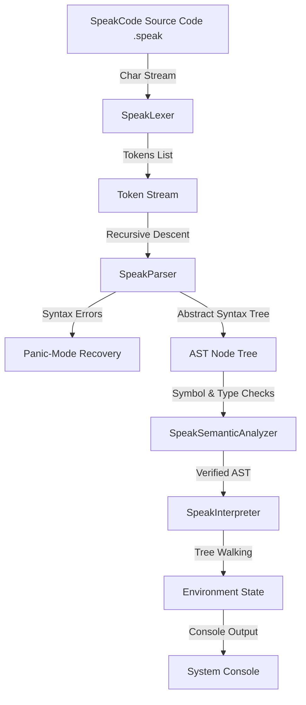
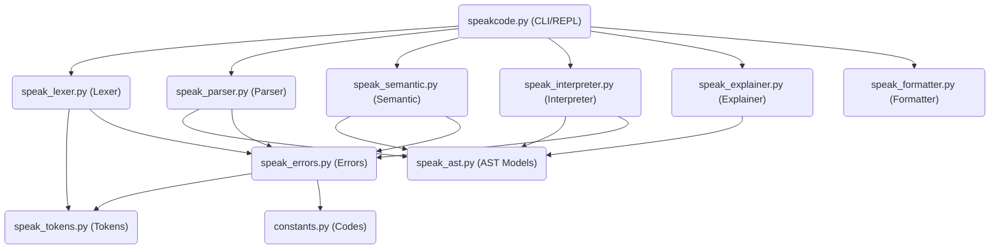

# 🎙️ SpeakCode Programming Language

<p align="center">
  
  
  
  
  
  
  
</p>

### *"Programming should feel like writing simple English."*

SpeakCode is a modular, conversational programming language compiler built from scratch in Python. It replaces traditional code punctuation and mathematical operators with explicit, English-like syntax and statement boundaries terminated by standard periods (`.`). Designed for computer science education and compiler research, it runs a full compiler front-end pipeline—lexing, parsing, static analysis, and interpretation—with robust recovery and diagnostics.

---

## 🗺️ Table of Contents
1. [Screenshots](#-screenshots)
2. [Introduction](#-introduction)
3. [Key Features](#-key-features)
4. [Compiler Pipeline](#-compiler-pipeline)
5. [Architecture](#-architecture)
6. [Language Specifications](#-language-specifications)
7. [Hello World Breakdown](#-hello-world-breakdown)
8. [Example Programs Directory](#-example-programs-directory)
9. [Installation & Setup](#-installation--setup)
10. [CLI Commands Reference](#-cli-commands-reference)
11. [Project File Tree](#-project-file-tree)
12. [Documentation Index](#-documentation-index)
13. [Testing Harness](#-testing-harness)
14. [Performance Metrics](#-performance-metrics)
15. [Diagnostic Error Reference](#-diagnostic-error-reference)
16. [Project Roadmap](#-project-roadmap)
17. [Contribution Guidelines](#-contribution-guidelines)
18. [Frequently Asked Questions (FAQ)](#-frequently-asked-questions-faq)
19. [B.Tech Viva & Academic Information](#-btech-viva--academic-information)
20. [Credits & License](#-credits--license)

---

## 🖼️ Screenshots

Below are placeholders representing the CLI toolkit visualization outputs:

*   **Interactive REPL Console Shell:**
    ```
    [Placeholder: terminal screenshot showing live, nested statement inputs and evaluations]
    ```
*   **Tokens Scans Table View (`tokens`):**
    ```
    [Placeholder: CLI table output showing color-coded TokenTypes, lexemes, and coordinates]
    ```
*   **Abstract Syntax Tree Visualizer (`ast`):**
    ```
    [Placeholder: Unicode layout tree representing parsed program AST Node branches]
    ```
*   **Plain English Explainer Output (`explain`):**
    ```
    [Placeholder: text output showing generated step-by-step English descriptions of logic]
    ```

---

## 📖 Introduction

SpeakCode was created to solve the double cognitive load that beginner developers experience: conceptualizing logic flow while struggling with arbitrary programming punctuation symbols (such as braces `{ }`, semicolons `;`, or binary symbols like `&&` or `||`).

SpeakCode replaces mathematical symbols and brackets with structured English keywords. It requires sentence termination periods (`.`) and first-word capitalizations, making the code read like a series of instructions written to another human.

---

## ✨ Key Features

-   **Stateful Scanner (`SpeakLexer`):** Groups characters, ignores comments, and resolves multi-word tokens (like `is same as` or `divided by`) using a length-sorted match map to prevent greedy prefix conflicts.
-   **Top-down Parser (`SpeakParser`):** Implements hand-written recursive descent parsing with panic-mode synchronization recovery.
-   **Static Semantic Analyzer (`SpeakSemanticAnalyzer`):** Features global function hoisting, variables scope lifetime tables, and static type checker controls.
-   **Tree-Walking Interpreter (`SpeakInterpreter`):** Executes program steps via parent-linked lexical environments, implementing call stacks and early returns.
-   **Formatting & Developer Tools:** Integrated line-by-line English explainer, 4-space indent formatter, and multiline REPL shell.

---

## ⚙️ Compiler Pipeline

The compiler transforms source code through the following stages:



### Pipeline Phase Responsibilities:
1.  **Lexical Analysis:** Scans characters, tracks coordinates, strips comments, and constructs tokens.
2.  **Syntactic Analysis:** Hand-written recursive descent matches grammar templates, synchronized via period (`.`) or block boundaries.
3.  **Semantic Analysis:** Hoists function headers globally, shadows local scopes, and verifies type constraints.
4.  **Interpretation:** Manages dynamic variables in parent-linked environment scopes and pushes virtual call stack frames.

---

## 🏗️ Architecture

### Module Dependencies Graph


---

## 📝 Language Specifications

SpeakCode enforces clean, verbose conversational syntax:

### Variables & Scopes
-   **Declaration:** `Remember <value> as <variable_name>.`
-   **Assignment:** `Change <variable_name> to <value>.`
-   **Lexical Scoping:** Variables are block-scoped and local scopes support shadowing of parent scope names.

### Relational & Logical Operators
-   **Math Operators:** `plus`, `minus`, `times`, `divided by`, `modulo`.
-   **Comparisons:** `is same as`, `is different from`, `is above`, `is below`, `is at least`, `is at most`.
-   **Logical Operations:** `and`, `or`, `opposite of` (negation).

### Flow Control Blocks
-   **Conditionals:**
    ```speakcode
    If <expression> then
        [statements]
    Otherwise if <expression> then
        [statements]
    Otherwise
        [statements]
    Finish checking.
    ```
-   **Loops:**
    -   *While Loop:* `While <expression> repeat [statements] Finish looping.`
    -   *Counted Loop:* `Repeat <expression> times [statements] Finish looping.`

### Reusable Procedures (Functions)
-   **Definition:**
    ```speakcode
    To perform <name> [with <p1> and <p2>]:
        [statements]
        Give back <expression>.
    Finish performance.
    ```
-   **Execution Call:**
    `Perform <name> [with <args>] [and save as <var>].`

---

## 💻 Hello World Breakdown

```speakcode
Speak "Hello, World!".
Remember "Conversational" as style.
Speak "Formatting: " plus style.
```

-   **Line 1:** Calls the `Speak` instruction with a String literal parameter. The first character is capitalized, and the statement is terminated by a period.
-   **Line 2:** Declares a variable named `style`, assigning the string `"Conversational"` to it in the active scope.
-   **Line 3:** Evaluates a binary `plus` string concatenation, combining the string literal `"Formatting: "` with the value of the variable `style`, and outputs the result (`Formatting: Conversational`).

---

## 📂 Example Programs Directory

The `examples/` directory contains 17 fully functional programs:

| Example File | Description | Core Language Concepts Demonstrated |
|---|---|---|
| [`hello_world.speak`](file:///c:/Users/krish%20vasoya/OneDrive/Desktop/sem%207/CD/miniproject/examples/hello_world.speak) | Standard greeting | String outputs, terminal prints. |
| [`calculator.speak`](file:///c:/Users/krish%20vasoya/OneDrive/Desktop/sem%207/CD/miniproject/examples/calculator.speak) | Terminal calculator | Numeric input prompts, math operators. |
| [`fizzbuzz.speak`](file:///c:/Users/krish%20vasoya/OneDrive/Desktop/sem%207/CD/miniproject/examples/fizzbuzz.speak) | Classic FizzBuzz | Modulo loops, conditional branches. |
| [`functions_demo.speak`](file:///c:/Users/krish%20vasoya/OneDrive/Desktop/sem%207/CD/miniproject/examples/functions_demo.speak) | Procedures demo | Hoisting, parameter bindings, scopes. |
| [`fibonacci.speak`](file:///c:/Users/krish%20vasoya/OneDrive/Desktop/sem%207/CD/miniproject/examples/fibonacci.speak) | Fibonacci numbers | Variable swaps, repeat loops. |
| [`guess_game.speak`](file:///c:/Users/krish%20vasoya/OneDrive/Desktop/sem%207/CD/miniproject/examples/guess_game.speak) | Guessing game | While loops, inputs, inequality checks. |
| [`shopping_bill.speak`](file:///c:/Users/krish%20vasoya/OneDrive/Desktop/sem%207/CD/miniproject/examples/shopping_bill.speak) | Discount calculator| Dynamic condition rules. |

*(For the complete guide on all 17 examples, see [Examples Guide](file:///c:/Users/krish%20vasoya/OneDrive/Desktop/sem%207/CD/miniproject/docs/Examples_Guide.md).)*

---

## 🚀 Installation & Setup

### 1. Requirements
-   **Python version:** Python 3.10, 3.11, or 3.12.
-   **Dependencies:** None (uses standard Python library modules only).

### 2. Execution Setup
Clone or copy the source folder to your project directory and run commands:
```bash
# Clone repository
git clone https://github.com/krisvasoya/SpeakCode.git
cd SpeakCode

# Verify installation by printing version
python speakcode.py version
```

### 3. Running Code
```bash
python speakcode.py run examples/hello_world.speak
```

---

## 🛠️ CLI Commands Reference

Coordinates compilation and formatting tasks:

| Command | Usage | Description |
|---|---|---|
| **`run`** | `python speakcode.py run <file>` | Runs static semantic checks and interprets the file. |
| **`tokens`** | `python speakcode.py tokens <file>` | Lexes and prints a formatted terminal tokens table. |
| **`ast`** | `python speakcode.py ast <file>` | Parses and draws an ASCII tree layout of AST nodes. |
| **`semantic`** | `python speakcode.py semantic <file>` | Runs static type and scoping checks (no execution). |
| **`explain`** | `python speakcode.py explain <file>` | Generates a line-by-line plain English translation. |
| **`format`** | `python speakcode.py format <file>` | Capitalizes keywords and normalizes 4-space indents. |
| **`repl`** | `python speakcode.py repl` | Launches the interactive checked multiline shell. |
| **`version`** | `python speakcode.py version` | Prints version details and Python environment metadata. |

---

## 📂 Project File Tree

```
SpeakCode/
├── docs/                             # Academic and reference documentation
│   ├── API_Documentation.md          # Core API specifications and parameters
│   ├── Developer_Guide.md            # Guidelines to extend the language compiler
│   ├── Examples_Guide.md             # Breakdown of all 17 example programs
│   ├── Project_Report.md             # Academic report containing 13 diagrams
│   ├── Release_Audit_Report.md       # Final v1.0 validation results
│   ├── Submission_Checklist.md       # Final project checklist
│   ├── User_Manual.md                # Language syntax reference
│   └── Viva_Preparation_Guide.md     # Examination prep guide with 150+ questions
├── examples/                         # 17 tested SpeakCode programs
├── tests/                            # Unit and performance stress tests
├── README.md                         # Project landing page
├── LICENSE                           # MIT License terms
├── CONTRIBUTING.md                   # Contribution instructions
├── CODE_OF_CONDUCT.md                # Community standards code
├── speakcode.py                      # Main entry CLI coordinator
├── speak_lexer.py                    # Stateful character scanner
├── speak_parser.py                   # Recursive descent parser
├── speak_semantic.py                 # Static scope and type analyzer
├── speak_interpreter.py              # Tree-walking interpreter
├── speak_errors.py                   # Custom exceptions and visual errors
├── speak_ast.py                      # Abstract Syntax Tree nodes
└── speak_tokens.py                   # Token structures and positions
```

---

## 📚 Documentation Index

For complete compiler details, reference the guides in the `docs/` folder:
- **[Project Report](docs/Project_Report.md):** Academic mini-project report with cover pages, certifications, and 13 Mermaid system diagrams.
- **[API Manual](docs/API_Documentation.md):** API reference details for all modules.
- **[Examples Guide](docs/Examples_Guide.md):** Logical breakdowns for all examples.
- **[Developer Guide](docs/Developer_Guide.md):** Extension manual.
- **[User Manual](docs/User_Manual.md):** Syntax instructions and setups.
- **[Viva Prep Guide](docs/Viva_Preparation_Guide.md):** Handbook containing 150+ categorized questions.
- **[Release Audit Report](docs/Release_Audit_Report.md):** Comprehensive v1.0 release quality checks.

---

## 🧪 Testing Harness

Verify project stability using our unit, stress, and integration tests:

```bash
# Run unit and stress tests (65 tests)
python -m unittest discover -s tests

# Run root-level integration tests (10 tests)
python test_runner.py
```

*Our lexical analyzer stress test profiles scanning speed on large files (scanning 120,000 tokens in under 0.5s).*

---

## 📈 Performance Complexity

Complexity metrics for each compiler stage:

| Stage | Time Complexity | Space Complexity | Focus |
|---|---|---|---|
| **Lexer (Scanner)** | $\mathcal{O}(N)$ | $\mathcal{O}(T)$ | Stateful character scanning, token mapping. |
| **Parser** | $\mathcal{O}(T)$ | $\mathcal{O}(D)$ | Recursive descent grammar mapping, synchronization. |
| **Semantic Analyzer**| $\mathcal{O}(A)$ | $\mathcal{O}(A + S)$ | Scoping tables lookup, global function hoisting. |
| **Interpreter** | $\mathcal{O}(I)$ | $\mathcal{O}(A + E)$ | Call frames stack allocations, tree walking. |

- *where $N$ = characters count, $T$ = tokens count, $D$ = recursion depth, $A$ = AST nodes count, $S$ = scopes depth, $I$ = runtime steps, $E$ = call stack frames.*

---

## 🚨 Diagnostic Error Reference

SpeakCode maps logical exceptions to formal codes to assist compiler diagnostics.

| Error Code | Category | Typical Trigger Examples |
|---|---|---|
| **`SPK101`** | Lexical Error | Invalid numeric literals (e.g. `10abc`) or illegal characters (e.g. `@`, `$`). |
| **`SPK102`** | Syntax Error | Missing periods (`.`), unmatched parentheses, or unclosed loops. |
| **`SPK103`** | Semantic Error | Re-declaring a variable within the same local scope block. |
| **`SPK104`** | Semantic Error | Accessing or modifying a variable before declaring it with `Remember`. |
| **`SPK105`** | Runtime Error | Modulo or division by zero. |
| **`SPK106`** | Semantic Error | Function argument count mismatches or calling undefined functions. |
| **`SPK107`** | Semantic Error | Using the return keyword `Give back` in the global scope block. |
| **`SPK108`** | Type Error | Operator type mismatches (e.g., subtracting a string, logic checks on numbers). |
| **`SPK999`** | Compiler Crash | Uncaught Python system exceptions. |

---

## 🗺️ Project Roadmap

- [x] **v1.0.0 (Current Release):** DEC, Parser recovery, hoisting, type verification, tools (formatter, explainer, REPL), and test suites.
- [ ] **v1.1.0 (Next Minor Release):** Support array collections (e.g. `Remember [1, 2] as items.`), dictionary mappings, and system utility standard library modules.
- [ ] **v2.0.0 (Future Major Release):** Compile AST nodes to custom bytecode executed on a stack VM, add object-oriented classes, and build a WebAssembly playground.

---

## 🤝 Contribution Guidelines

We welcome contributions! Please follow these standards:
- **Style:** Python code must be PEP 8 compliant and include complete type hints.
- **Commit Format:** Use prefix commits (e.g., `feat: add repeat loops`, `fix: correct lexer columns`).
- **PR Rules:** Create a branch off `main`, add unit tests under `tests/`, and verify all tests pass before submitting your PR.
  *(See [CONTRIBUTING.md](CONTRIBUTING.md) for details.)*

---

## ❓ Frequently Asked Questions (FAQ)

<details>
<summary><b>1. Why was SpeakCode created?</b></summary>
SpeakCode was created as an educational programming language to eliminate syntax pain points (like braces and semicolons) for beginners, allowing them to focus on logic first.
</details>

<details>
<summary><b>2. Is SpeakCode compiled or interpreted?</b></summary>
It is processed by a multi-pass compiler front end (lexing, parsing, and static analysis) and executed by a tree-walking interpreter.
</details>

<details>
<summary><b>3. Why are statement periods (.) mandatory?</b></summary>
Periods replace semicolons as statement terminators to make code blocks read like standard English sentences.
</details>

<details>
<summary><b>4. What happens on division by zero?</b></summary>
The interpreter detects division by zero before execution and throws a runtime exception (`SPK105`) instead of returning infinity or crashing.
</details>

<details>
<summary><b>5. How does the compiler handle syntax errors?</b></summary>
It uses panic-mode synchronization. It logs the error and advances past the current statement (to the next period or block closure) to resume parsing and catch additional errors.
</details>

<details>
<summary><b>6. What is global function hoisting?</b></summary>
It is a pre-pass that registers all function signatures globally before statements are executed. This allows functions to be called before they are declared in the code.
</details>

<details>
<summary><b>7. Are variable types checked statically?</b></summary>
Yes, the semantic analyzer performs static type checking on expressions before execution, flagging type mismatches.
</details>

<details>
<summary><b>8. Is variable shadowing allowed?</b></summary>
Yes, nested blocks can redeclare variables of the same name. This shadows the outer variable locally without modifying its value in the parent scope.
</details>

<details>
<summary><b>9. Does SpeakCode support recursion?</b></summary>
Yes, custom procedures defined with `To perform` support recursive self-calls.
</details>

<details>
<summary><b>10. Why is the compiler written in Python?</b></summary>
Python was chosen for its readability, standard libraries (like `dataclasses`), and suitability for prototyping educational frameworks.
</details>

<details>
<summary><b>11. Can I run SpeakCode interactively?</b></summary>
Yes, run `python speakcode.py repl` to start the interactive multiline console shell.
</details>

<details>
<summary><b>12. How does the code formatter work?</b></summary>
It normalizes keyword casing and applies standard 4-space nesting indentation, ignoring string literals to preserve data.
</details>

<details>
<summary><b>13. What is the role of `speak_ast.py`?</b></summary>
It defines typed, immutable dataclasses that represent AST nodes, supporting pretty-printing and dictionary serialization.
</details>

<details>
<summary><b>14. Why is `speak_symbols.py` unused?</b></summary>
It is a redundant symbol table module from an earlier design iteration. Scope verification is now handled in `speak_semantic.py`.
</details>

<details>
<summary><b>15. Does the interpreter use Python's call stack?</b></summary>
Yes, it dispatches AST nodes recursively using Python's call stack, passing arguments to nested local environments.
</details>

<details>
<summary><b>16. How does the explainer tool work?</b></summary>
It walks the AST and outputs plain English sentences describing the actions of each statement node.
</details>

<details>
<summary><b>17. Can I import external files in SpeakCode?</b></summary>
No, Version 1.0 supports single-file compilation only. Multi-file linking is planned for a future release.
</details>

<details>
<summary><b>18. What error code is raised for duplicate declarations?</b></summary>
Duplicate declarations within the same scope raise semantic error `SPK103`.
</details>

<details>
<summary><b>19. How are emojis supported in variable names?</b></summary>
The lexer allows any character with a Unicode code point greater than 127 in identifier names.
</details>

<details>
<summary><b>20. What is the execution speed of the lexer?</b></summary>
The lexer is highly optimized, scanning approximately 300,000 tokens per second.
</details>

---

## 🎓 Academic Objectives & Learning Outcomes

SpeakCode was submitted as a B.Tech 7th Semester Mini Project in Compiler Design. 

### Core Learning Objectives:
- Implementing regular expression patterns for multi-word lexical tokens.
- Hand-writing recursive descent parsing and error recovery loops.
- Designing abstract syntax trees and double-dispatch visitor interfaces.
- Managing nested static scopes and dynamic call stack environments.
- Building unified CLI tools and test suites for compiler validation.

---

## 👥 Credits

-   **Author:** Krish Vasoya
-   **Department:** Bachelor of Technology - Computer Science & Design (CSD)
-   **Academic Year:** 2026

---

## 📄 License

This project is licensed under the MIT License - see the [LICENSE](LICENSE) file for details.

---

<p align="center">
  <b>Designed with ❤️ for computer science education and compiler design research.</b>
</p>
