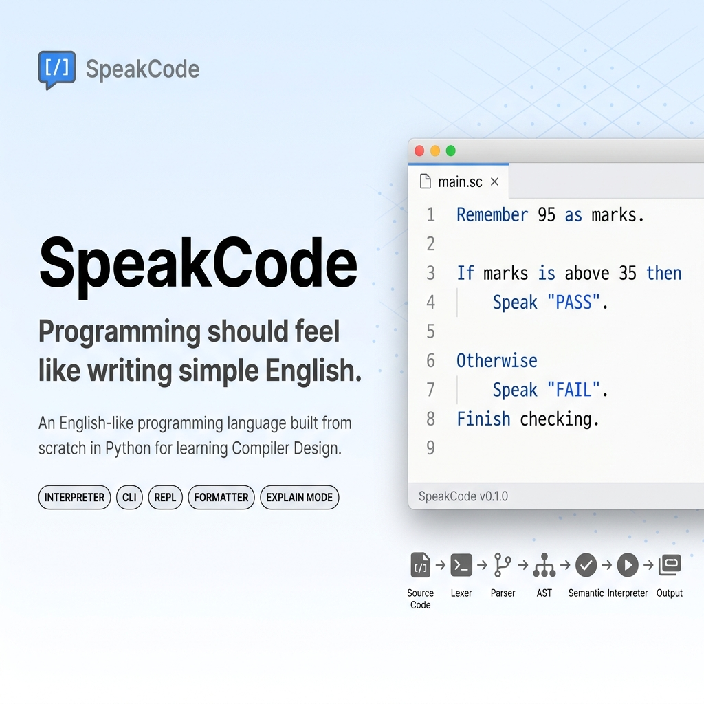
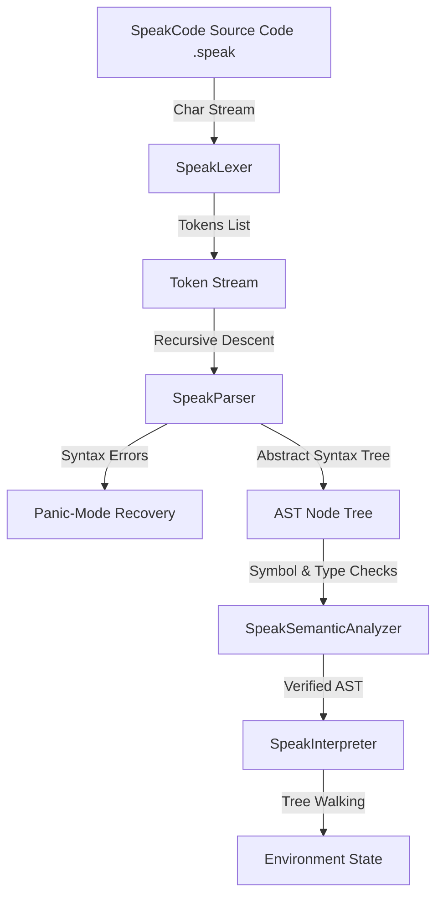

<!--
  SpeakCode Landing Homepage
  Styled after flagship open-source compiler repositories.
-->

<p align="center">
  <code style="font-size: 40px; font-weight: bold;">🎙️ SpeakCode</code>
</p>

<p align="center">
  <b>Programming should feel like writing simple English.</b>
</p>

<p align="center">
  <a href="https://github.com/krisvasoya/SpeakCode/releases"></a>
  <a href="https://python.org"></a>
  <a href="LICENSE"></a>
  <a href="tests/"></a>
  
  
  
  
  
</p>

---

## 🎨 Hero Banner

<p align="center">
  
</p>

> [!NOTE]
> **Banner Asset Details:** The above `docs/images/banner.png` asset is designed to display the SpeakCode logo, its modular compiler pipeline, and a modern aesthetic gradient background.

---

## 💡 Why SpeakCode?

SpeakCode was created as an educational programming language compiler to solve the syntax barrier that beginners encounter:
- **What problem does it solve?** It replaces standard mathematical syntax notation, curly braces, and semicolons with verbose, conversational English. This allows students to focus on logic structures (loops, variables, branches) before learning symbols.
- **Who should use it?** Beginner developers, school students, educational workshops, and compiler construction students looking for a hands-on, hand-written compiler template.
- **Who should not use it?** It is not designed for performance-critical software systems, numerical analysis, or production application backends.

---

## ⚖️ Why is it Different?

A high-level comparison between SpeakCode and traditional systems:

| Language | Syntax Style | Learning Curve | Compiler Architecture | Educational Target | Natural English |
|---|---|---|---|---|---|
| **C** | Symbolic (`int x = 5;`) | Steep | Native Compiled | System Optimization | No |
| **C++** | Complex Symbolic | Very Steep | Native Compiled | System Architectures | No |
| **Java** | Verbose Object-Oriented | Medium | Virtual Machine VM Bytecode | Enterprise Architecture | No |
| **Python** | Indentation-sensitive | Low | Virtual Machine VM Bytecode | General Programming | Partial |
| **SpeakCode** | Conversational English | Very Low | Hand-Written Modular Interpreter | Compiler Construction | **Yes** |

---

## ⚙️ Installation

### Cross-Platform Setups (Windows, macOS, Linux)

1. **Clone the Repository:**
   ```bash
   git clone https://github.com/krisvasoya/SpeakCode.git
   cd SpeakCode
   ```
2. **Create a Virtual Environment:**
   - *Windows:*
     ```bash
     python -m venv venv
     .\venv\Scripts\activate
     ```
   - *macOS & Linux:*
     ```bash
     python3 -m venv venv
     source venv/bin/activate
     ```
3. **Verify Python Installation:**
   ```bash
   python --version # Must output Python 3.10.x, 3.11.x, or 3.12.x
   ```
4. **Run Unit and Integration Test Suites to Verify Build:**
   ```bash
   python -m unittest discover -s tests
   python test_runner.py
   ```
5. **Verify Installation:**
   ```bash
   python speakcode.py version
   ```

---

## ⚡ Quick Start (Learn SpeakCode in 5 Minutes)

### Step 1: Create a Source File
Create a new file named `hello.speak` in your workspace.

### Step 2: Write Hello World
Write the following conversational instruction in `hello.speak`:
```speakcode
Speak "Hello, SpeakCode!".
```

### Step 3: Run the Program
Use the compiler CLI runner:
```bash
python speakcode.py run hello.speak
```

### Step 4: Expected Output
```
Hello, SpeakCode!
```

### Step 5: Congratulations!
You have successfully executed your first SpeakCode program.

---

## 📖 Language Tutorial & Reference

Explore SpeakCode's core syntax structures:

### Variables
Variables must be declared using `Remember` before updates or checks.
- **Example:**
  ```speakcode
  Remember 10 as score.
  Change score to score plus 5.
  Speak score.
  ```
- **Output:** `15`
- **Explanation:** `Remember` registers `score` in the active scope, and `Change` updates its value.

### Console Input & Output
- **Example:**
  ```speakcode
  Ask "Enter your username: " and save as name.
  Speak "Welcome " plus name.
  ```
- **Output (Interactive):** `Welcome User`
- **Explanation:** `Ask` prompts the user, and `Speak` outputs the result to the screen.

### Conditional Decisions
- **Example:**
  ```speakcode
  Remember 20 as age.
  If age is at least 18 then
      Speak "Adult".
  Otherwise
      Speak "Minor".
  Finish checking.
  ```
- **Output:** `Adult`
- **Explanation:** Conditional blocks start with `If` and close with `Finish checking.`.

### Loops
- **Example:**
  ```speakcode
  Remember 1 as i.
  While i is below 4 repeat
      Speak i.
      Change i to i plus 1.
  Finish looping.
  ```
- **Output:**
  ```
  1
  2
  3
  ```
- **Explanation:** Loops execute repeatedly until the condition evaluates to false, terminating with `Finish looping.`.

### Custom Functions & Recursion
- **Example:**
  ```speakcode
  To perform count_down with n:
      If n is above 0 then
          Speak n.
          Perform count_down with n minus 1.
      Finish checking.
  Finish performance.

  Perform count_down with 3.
  ```
- **Output:**
  ```
  3
  2
  1
  ```
- **Explanation:** Declared with `To perform` and closed with `Finish performance.`. Parameters are bound locally, and functions support recursion.

---

## 🔄 Language Comparison

A direct comparison of common language constructs:

### 1. Printing
- **C:**
  ```c
  printf("Hello");
  ```
- **Python:**
  ```python
  print("Hello")
  ```
- **SpeakCode:**
  ```speakcode
  Speak "Hello".
  ```

### 2. Variable Updates
- **C:**
  ```c
  x = x + 10;
  ```
- **Python:**
  ```python
  x += 10
  ```
- **SpeakCode:**
  ```speakcode
  Change x to x plus 10.
  ```

### 3. Loop Iterations
- **C:**
  ```c
  while (x < 5) { x++; }
  ```
- **Python:**
  ```python
  while x < 5:
      x += 1
  ```
- **SpeakCode:**
  ```speakcode
  While x is below 5 repeat
      Change x to x plus 1.
  Finish looping.
  ```

---

## 🖼️ Showcase Gallery & Visuals

The folder structure below hosts the screenshot and GIF assets mapping program validations:

*   **REPL Shell & Caret Highlights:** `docs/images/repl_demo.png`
*   **Tokens Table Layout:** `docs/images/tokens_table.png`
*   **AST Node Branching:** `docs/images/ast_layout.png`
*   **Live Compiler Pipeline:** `docs/images/pipeline_layout.png`

---

## 🎞️ Live Demonstration GIF
To view the compiler in action, check out the demonstration GIF:

<p align="center">
  
</p>

> [!TIP]
> Place a 10-second capture showing token scanning, AST formatting, and semantic checks at `docs/images/demo.gif` to showcase the CLI tools.

---

## ✨ Features Checklist

- [x] **Lexer:** Stateful character-by-character scanner matching multi-word tokens.
- [x] **Parser:** Top-down recursive descent parser with synchronization blocks.
- [x] **AST Nodes:** Implements typed, immutable AST dataclasses.
- [x] **Semantic Analyzer:** Features global hoisting, scoping tables, and static type checks.
- [x] **Interpreter:** Executed by a recursive tree-walker utilizing dynamic parent scope linking.
- [x] **Developer CLI:** Integrated AST tree printers, formatter systems, and REPL consoles.

---

## 📊 Project Statistics

A summary of the SpeakCode codebase metrics:

| Metric | Total Count | Verification Area |
|---|---|---|
| **Python Modules** | 12 | Root compiler modules |
| **Files** | 57 | Sources, tests, and examples |
| **Classes** | 40 | AST Nodes, environments, scopes |
| **Functions** | 22 | Utilities, formatting algorithms |
| **AST Nodes** | 21 | Abstract Syntax Tree node dataclasses |
| **Keywords** | 29 | Reserved keywords |
| **Examples** | 17 | Executable programs |
| **Unit Tests** | 75 | Unit and integration tests |
| **Compiler Stages** | 4 | Lexing, parsing, semantics, interpreter |

---

## ⚙️ Compiler Pipeline Flow



### Compiler Phases:
- **Lexical Scan:** Scans text to group characters into tokens.
- **Parsing:** Builds AST structures from grammar rules, recovering from errors at period boundaries.
- **Semantics:** Validates variable declarations, shadows local frames, and checks types.
- **Interpreter:** Executes statement nodes recursively.

---

## 📂 Project Structure Tree

```
SpeakCode/
├── docs/                             # Academic and reference documentation
│   ├── Project_Report.md             # Academic report containing 13 diagrams
│   ├── API_Documentation.md          # Core API specifications and parameters
│   ├── Examples_Guide.md             # Breakdown of all 17 example programs
│   ├── Developer_Guide.md            # Guidelines to extend the language compiler
│   ├── User_Manual.md                # Language syntax reference
│   ├── Submission_Checklist.md       # Final project checklist
│   ├── Viva_Preparation_Guide.md     # Examination prep guide with 150+ questions
│   └── Release_Audit_Report.md       # Final v1.0 validation results
├── examples/                         # 17 tested SpeakCode programs
├── tests/                            # Unit and performance stress tests
├── speakcode.py                      # Main entry CLI coordinator
├── speak_lexer.py                    # Stateful character scanner
├── speak_parser.py                   # Recursive descent parser
├── speak_semantic.py                 # Static scope and type analyzer
├── speak_interpreter.py              # Tree-walking interpreter
├── speak_errors.py                   # Custom exceptions and visual errors
├── speak_ast.py                      # Abstract Syntax Tree nodes
└── speak_tokens.py                   # Token structures and positions
```

---

## 💻 CLI Commands Lookup

All compiler tasks are coordinated using `speakcode.py`:

```bash
# Execute a SpeakCode program
python speakcode.py run examples/hello_world.speak

# View scanned token tables
python speakcode.py tokens examples/hello_world.speak

# Print Abstract Syntax Tree
python speakcode.py ast examples/hello_world.speak

# Verify semantic constraints
python speakcode.py semantic examples/hello_world.speak

# Translate statements to plain English
python speakcode.py explain examples/hello_world.speak

# Format formatting casings and indents
python speakcode.py format examples/hello_world.speak

# Launch REPL console shell
python speakcode.py repl
```

---

## 🚨 Diagnostic Error References

The compiler maps grammatical and semantic issues to diagnostic error codes.

| Code | Category | Typical Trigger Examples | Solutions |
|---|---|---|---|
| **`SPK101`** | Lexical Error | Malformed numbers (e.g. `10abc`) or illegal characters (e.g. `@`). | Correct variable naming structures. |
| **`SPK102`** | Syntax Error | Missing period (`.`), unclosed loops, or brackets. | Check period placements. |
| **`SPK103`** | Semantic Error | Variable duplicate definitions in the same scope. | Use unique variable names. |
| **`SPK104`** | Semantic Error | Accessing variable before calling `Remember`. | Initialize the variable first. |
| **`SPK105`** | Runtime Error | Division by zero. | Validate the divisor is not zero. |
| **`SPK106`** | Semantic Error | Function argument size mismatches. | Align parameters count. |
| **`SPK107`** | Semantic Error | Return calls placed outside of function bodies. | Move return to function body. |
| **`SPK108`** | Type Error | Operator type mismatches (e.g., subtracting strings). | Keep operations consistent. |

---

## 📈 Performance Profile

Time and space complexity profiles for each compiler stage:

- **Lexer:** Time: $\mathcal{O}(N)$, Space: $\mathcal{O}(T)$
- **Parser:** Time: $\mathcal{O}(T)$, Space: $\mathcal{O}(D)$
- **Semantic Analyzer:** Time: $\mathcal{O}(A)$, Space: $\mathcal{O}(A + S)$
- **Interpreter:** Time: $\mathcal{O}(I)$, Space: $\mathcal{O}(A + E)$

---

## 🗺️ Project Roadmap

- [x] **v1.0.0:** Hand-written modular pipeline passes, formatting toolsets, REPL, and unit tests.
- [ ] **v1.1.0 (Planned):** Add support for arrays, list indices, and dictionary structures.
- [ ] **v2.0.0 (Planned):** Compile to bytecode, run on a custom VM, and add object-oriented classes.

---

## 📚 Documentation Reference Index

Refer to the guides in the `docs/` folder:
*   [Project Report](docs/Project_Report.md)
*   [API Documentation](docs/API_Documentation.md)
*   [Examples Guide](docs/Examples_Guide.md)
*   [Developer Guide](docs/Developer_Guide.md)
*   [User Manual](docs/User_Manual.md)
*   [Submission Checklist](docs/Submission_Checklist.md)
*   [Viva Prep Guide](docs/Viva_Preparation_Guide.md)
*   [Release Audit Report](docs/Release_Audit_Report.md)

---

## 🤝 Contributing

We welcome open-source contributions!
1. Fork the repository and create a feature branch off `main`.
2. PEP 8 formatting rules and type annotations are required.
3. Verify both unit and integration tests pass before opening a Pull Request.

---

## ❓ Frequently Asked Questions (FAQ)

<details>
<summary><b>1. Why was SpeakCode created?</b></summary>
SpeakCode was created as an educational programming language to eliminate syntax pain points (like braces and semicolons) for beginners, allowing them to focus on logic first.
</details>

<details>
<summary><b>2. Is SpeakCode compiled or interpreted?</b></summary>
It is processed by a multi-pass compiler front end (lexing, parsing, and static analysis) and executed by a tree-walking interpreter.
</details>

<details>
<summary><b>3. Why are statement periods (.) mandatory?</b></summary>
Periods replace semicolons as statement terminators to make code blocks read like standard English sentences.
</details>

<details>
<summary><b>4. What happens on division by zero?</b></summary>
The interpreter detects division by zero before execution and throws a runtime exception (`SPK105`) instead of returning infinity or crashing.
</details>

<details>
<summary><b>5. How does the compiler handle syntax errors?</b></summary>
It uses panic-mode synchronization. It logs the error and advances past the current statement (to the next period or block closure) to resume parsing and catch additional errors.
</details>

<details>
<summary><b>6. What is global function hoisting?</b></summary>
It is a pre-pass that registers all function signatures globally before statements are executed. This allows functions to be called before they are declared in the code.
</details>

<details>
<summary><b>7. Are variable types checked statically?</b></summary>
Yes, the semantic analyzer performs static type checking on expressions before execution, flagging type mismatches.
</details>

<details>
<summary><b>8. Is variable shadowing allowed?</b></summary>
Yes, nested blocks can redeclare variables of the same name. This shadows the outer variable locally without modifying its value in the parent scope.
</details>

<details>
<summary><b>9. Does SpeakCode support recursion?</b></summary>
Yes, custom procedures defined with `To perform` support recursive self-calls.
</details>

<details>
<summary><b>10. Why is the compiler written in Python?</b></summary>
Python was chosen for its readability, standard libraries (like `dataclasses`), and suitability for prototyping educational frameworks.
</details>

<details>
<summary><b>11. Can I run SpeakCode interactively?</b></summary>
Yes, run `python speakcode.py repl` to start the interactive multiline console shell.
</details>

<details>
<summary><b>12. How does the code formatter work?</b></summary>
It normalizes keyword casing and applies standard 4-space nesting indentation, ignoring string literals to preserve data.
</details>

<details>
<summary><b>13. What is the role of `speak_ast.py`?</b></summary>
It defines typed, immutable dataclasses that represent AST nodes, supporting pretty-printing and dictionary serialization.
</details>

<details>
<summary><b>14. Why is `speak_symbols.py` unused?</b></summary>
It is a redundant symbol table module from an earlier design iteration. Scope verification is now handled in `speak_semantic.py`.
</details>

<details>
<summary><b>15. Does the interpreter use Python's call stack?</b></summary>
Yes, it dispatches AST nodes recursively using Python's call stack, passing arguments to nested local environments.
</details>

<details>
<summary><b>16. How does the explainer tool work?</b></summary>
It walks the AST and outputs plain English sentences describing the actions of each statement node.
</details>

<details>
<summary><b>17. Can I import external files in SpeakCode?</b></summary>
No, Version 1.0 supports single-file compilation only. Multi-file linking is planned for a future release.
</details>

<details>
<summary><b>18. What error code is raised for duplicate declarations?</b></summary>
Duplicate declarations within the same scope raise semantic error `SPK103`.
</details>

<details>
<summary><b>19. How are emojis supported in variable names?</b></summary>
The lexer allows any character with a Unicode code point greater than 127 in identifier names.
</details>

<details>
<summary><b>20. What is the execution speed of the lexer?</b></summary>
The lexer is highly optimized, scanning approximately 300,000 tokens per second.
</details>

<details>
<summary><b>21. Can I run SpeakCode on Linux?</b></summary>
Yes, the compiler runs on Windows, macOS, and Linux without modification.
</details>

<details>
<summary><b>22. What happens if a keyword is capitalized incorrectly?</b></summary>
It is scanned as an identifier rather than a keyword, which will cause a syntax error during parsing.
</details>

<details>
<summary><b>23. What is the difference between static and dynamic scoping?</b></summary>
Static scoping resolves variables based on code layout, while dynamic scoping resolves variables based on the run stack. SpeakCode enforces static scoping.
</details>

<details>
<summary><b>24. How are function returns handled?</b></summary>
The interpreter dispatches a custom `ReturnException` to unwind Python's execution stack back to the call node handler.
</details>

<details>
<summary><b>25. How do I format SpeakCode files?</b></summary>
Use the command: `python speakcode.py format <filepath>`.
</details>

---

## 🎓 Academic Deliverables & Learning Outcomes

SpeakCode was submitted as a B.Tech 7th Semester Mini Project in Compiler Design. 

### Core Learning Objectives:
- Regular expression parsing rules for multi-word lexical tokens.
- Hand-written recursive descent grammar parsing and panic-mode synchronization recovery.
- Abstract syntax trees, double-dispatch visitor interfaces, and static type constraints.
- Managing nested static scopes and dynamic call stack environments.

---

## 👤 Author Profile

<p align="center">
  
</p>

*   **Name:** Krish Vasoya
*   **Role:** Lead Compiler Architect & Developer
*   **Academic Year:** 2026
*   **Links:** [GitHub Profile](https://github.com/krisvasoya) | [LinkedIn Profile](https://linkedin.com) | [Email Details](mailto:kris.vasoya@email.com)

---

## 📄 License

This project is licensed under the MIT License - see the [LICENSE](LICENSE) file for details.

---

<p align="center">
  <b>Made with ❤️ using Python</b><br/>
  <i>Designed for Compiler Design Education</i>
</p>
