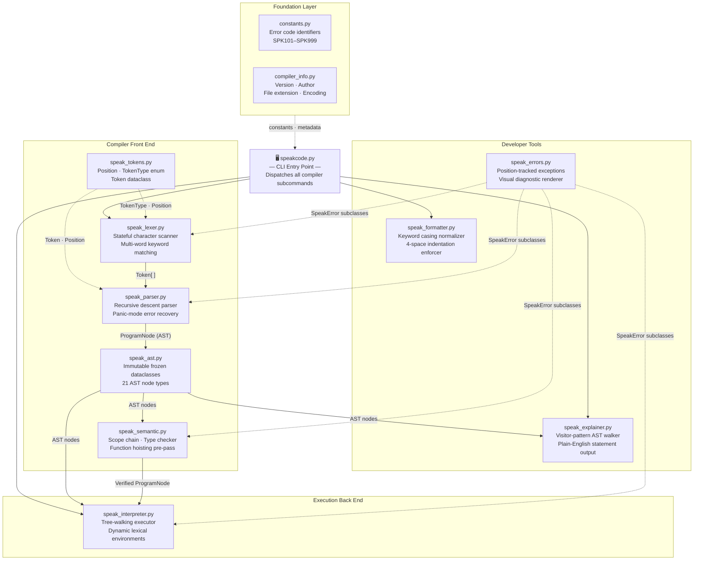

<p align="center">
  
</p>

<p align="center">
  <a href="https://github.com/krisvasoya/SpeakCode/releases"></a>
  <a href="https://github.com/krisvasoya/SpeakCode/stargazers"></a>
  <a href="https://github.com/krisvasoya/SpeakCode/forks"></a>
  <a href="LICENSE"></a>
  <a href="https://github.com/krisvasoya/SpeakCode/commits/main"></a>
  
  
</p>

<p align="center">
  <b>An English-like programming language and compiler — built from scratch in Python.</b><br/>
  Write code the way you speak. No curly braces. No semicolons. Just plain English.
</p>

<p align="center">
  <a href="#installation">Install</a> ·
  <a href="#quick-start">Quick Start</a> ·
  <a href="#language-reference">Language Reference</a> ·
  <a href="#cli-reference">CLI</a> ·
  <a href="#documentation">Docs</a> ·
  <a href="#contributing">Contributing</a>
</p>

---

## Table of Contents

- [Why SpeakCode?](#why-speakcode)
- [How it Compares](#how-it-compares)
- [Installation](#installation)
- [Quick Start](#quick-start)
- [Language Reference](#language-reference)
- [CLI Reference](#cli-reference)
- [Compiler Architecture](#compiler-architecture)
- [Project Structure](#project-structure)
- [Error Reference](#error-reference)
- [Roadmap](#roadmap)
- [Documentation](#documentation)
- [Contributing](#contributing)
- [FAQ](#faq)
- [Author](#author)
- [License](#license)

---

## Why SpeakCode?

Most programming languages require students to learn symbolic syntax — semicolons, curly braces, and mathematical notation — before they can write a single meaningful program. SpeakCode removes that barrier.

**SpeakCode is for:**
- Students learning programming concepts for the first time
- Educators building beginner coding workshops
- Compiler Design students who want a real, hand-written compiler to study

**SpeakCode is not for:**
- Production applications or backend systems
- Performance-critical or numerical computing
- Replacing general-purpose languages

---

## How it Compares

### Language Design

| Feature | C | Python | Java | **SpeakCode** |
|---|---|---|---|---|
| Syntax style | Symbolic | Indented | Object-oriented | Conversational English |
| Learning curve | Steep | Low | Medium | Very Low |
| Statement terminator | `;` | Newline | `;` | `.` (period) |
| Execution model | Native compiled | Bytecode VM | Bytecode VM | Tree-walking interpreter |
| Primary target | Systems | General | Enterprise | **Compiler education** |
| Natural English syntax | No | Partial | No | **Yes** |

### Code Side-by-Side

| Task | Python | SpeakCode |
|---|---|---|
| Print | `print("Hello")` | `Speak "Hello".` |
| Variable | `score = 10` | `Remember 10 as score.` |
| Update | `score += 5` | `Change score to score plus 5.` |
| Condition | `if age >= 18:` | `If age is at least 18 then` |
| Loop | `while x < 5:` | `While x is below 5 repeat` |
| Function | `def greet(name):` | `To perform greet with name:` |

---

## Installation

**Requirements:** Python 3.10, 3.11, or 3.12. No third-party packages needed.

```bash
# 1. Clone the repository
git clone https://github.com/krisvasoya/SpeakCode.git
cd SpeakCode
```

```bash
# 2a. Create a virtual environment (Windows)
python -m venv venv
.\venv\Scripts\activate

# 2b. Create a virtual environment (macOS / Linux)
python3 -m venv venv
source venv/bin/activate
```

```bash
# 3. Run the test suite to confirm everything works
python -m unittest discover -s tests
python test_runner.py
```

```bash
# 4. Verify the compiler
python speakcode.py version
```

---

## Quick Start

Create `hello.speak`:

```
Speak "Hello, SpeakCode!".
```

Run it:

```bash
python speakcode.py run hello.speak
```

Output:

```
Hello, SpeakCode!
```

---

## Language Reference

### Variables

```
Remember 10 as score.
Change score to score plus 5.
Speak score.
```

Output: `15`

Variables are declared with `Remember` and updated with `Change`. Redeclaring a variable in the same scope raises `SPK103`.

---

### Input & Output

```
Ask "Enter your name: " and save as name.
Speak "Welcome " plus name.
```

`Ask` reads from stdin. `Speak` prints to stdout.

---

### Conditionals

```
Remember 20 as age.
If age is at least 18 then
    Speak "Adult".
Otherwise
    Speak "Minor".
Finish checking.
```

Blocks open with `If … then` and close with `Finish checking.`

---

### Loops

```
Remember 1 as i.
While i is below 4 repeat
    Speak i.
    Change i to i plus 1.
Finish looping.
```

Output: `1  2  3`

Blocks open with `While … repeat` and close with `Finish looping.`

---

### Functions & Recursion

```
To perform count_down with n:
    If n is above 0 then
        Speak n.
        Perform count_down with n minus 1.
    Finish checking.
Finish performance.

Perform count_down with 3.
```

Output: `3  2  1`

Declared with `To perform`, called with `Perform`. Recursion is fully supported.

---

### Operators

| Operation | Syntax |
|---|---|
| Add | `x plus y` |
| Subtract | `x minus y` |
| Multiply | `x times y` |
| Divide | `x divided by y` |
| Equal | `x is equal to y` |
| Not equal | `x is not equal to y` |
| Greater | `x is above y` |
| Less | `x is below y` |
| Greater or equal | `x is at least y` |
| Less or equal | `x is at most y` |

---

## CLI Reference

```bash
python speakcode.py run <file>        # Execute a program
python speakcode.py tokens <file>     # Print the token stream
python speakcode.py ast <file>        # Print the Abstract Syntax Tree
python speakcode.py semantic <file>   # Run semantic analysis only
python speakcode.py explain <file>    # Translate code to plain English
python speakcode.py format <file>     # Format and normalize a file
python speakcode.py repl              # Start the interactive REPL
python speakcode.py version           # Print compiler version
```

---

## Compiler Architecture

### Module Dependency Graph



---

### Pipeline Stages

| # | Stage | Module | Input | Output | Key Behaviour |
|---|---|---|---|---|---|
| 1 | **Lexical Analysis** | `speak_lexer.py` | Raw source text | `Token[]` stream | Matches multi-word keywords longest-first; tracks line/column via `Position` |
| 2 | **Syntax Analysis** | `speak_parser.py` | `Token[]` stream | `ProgramNode` AST | Top-down recursive descent; collects errors and recovers at `.` boundaries |
| 3 | **Semantic Analysis** | `speak_semantic.py` | `ProgramNode` AST | Validated AST | Global function hoisting pre-pass; parent-pointer scope chain resolution |
| 4 | **Interpretation** | `speak_interpreter.py` | Validated AST | Program output | Tree-walking executor; `ReturnException` for call-stack unwinding |

> **Error recovery:** On any syntax error the parser logs the diagnostic and advances to the next period (`.`), allowing multiple errors to be reported in a single compilation pass.

> **Function hoisting:** Before any statement executes, the semantic analyzer registers every `To perform` declaration globally — functions may be called before they appear in the file.

---

## Project Structure

### Directory Tree

```
SpeakCode/                                 English-syntax programming language compiler
│
│  ── Core Compiler ──────────────────────────────────────────────────────────────────
│
├── 📄 speakcode.py               CLI entry point — parses subcommands (run, tokens, ast,
│                                 semantic, debug, explain, format, repl, version, help)
│                                 and coordinates the full compiler pipeline
│
├── 📄 speak_tokens.py            Tokenization foundation — defines the immutable Position
│                                 dataclass for source coordinates, the @unique TokenType
│                                 enum (29 keyword categories), and the Token record
│
├── 📄 speak_lexer.py             Stateful lexical scanner — converts raw UTF-8 source into
│                                 a position-tracked Token list; matches multi-word keywords
│                                 longest-first; supports escape sequences and debug stats
│
├── 📄 speak_parser.py            Hand-written recursive descent parser — converts the Token
│                                 stream into a ProgramNode AST; collects SPK102 syntax errors
│                                 and uses panic-mode recovery at period (.) boundaries
│
├── 📄 speak_ast.py               Abstract Syntax Tree node library — 21 strongly-typed,
│                                 frozen dataclass nodes; each implements accept() (visitor),
│                                 stringify() (code regeneration), pretty_print() (ASCII tree),
│                                 and to_dict() (serialization)
│
├── 📄 speak_semantic.py          Static semantic analyzer — implements a Scope class with
│                                 parent-pointer chain resolution; performs a function-hoisting
│                                 pre-pass; validates variable declarations (SPK103/SPK104),
│                                 type consistency (SPK108), and return placement (SPK107)
│
├── 📄 speak_interpreter.py       Tree-walking interpreter — evaluates verified AST nodes
│                                 using dynamic lexical environments; propagates function
│                                 returns via ReturnException; handles SPK105 (division by zero)
│                                 and coerces console input to numeric/boolean types
│
├── 📄 speak_errors.py            Diagnostic error system — position-tracked exception
│                                 hierarchy (SpeakLexerError, SpeakSyntaxError,
│                                 SpeakSemanticError, SpeakRuntimeError, SpeakTypeError);
│                                 format_error() renders source-line pointers and suggestions
│
├── 📄 speak_formatter.py         Source code formatter — normalizes keyword capitalization
│                                 (e.g. "remember" → "Remember") and enforces 4-space
│                                 indentation inside If/While/function bodies; preserves
│                                 string literals unchanged
│
├── 📄 speak_explainer.py         AST plain-English translator — visitor-pattern walker
│                                 that visits every statement node and produces readable
│                                 English descriptions (e.g. "Creates a variable named
│                                 'score' initialized with value: 10.")
│
│  ── Shared Infrastructure ───────────────────────────────────────────────────────────
│
├── 📄 constants.py               Shared diagnostic constants — maps SPK101–SPK999 error
│                                 code strings to human-readable category names used by
│                                 speak_errors.py at runtime
│
├── 📄 compiler_info.py           Compiler metadata — Final[str] constants for language
│                                 name, version (1.0.0), author, department, file extension
│                                 (.speak), source encoding (utf-8), and default indentation
│
├── 📄 speak_symbols.py           Early-iteration Environment class — parent-pointer scope
│                                 chain with define/lookup/update; superseded by the
│                                 typed Scope class in speak_semantic.py (retained for reference)
│
│  ── Integration Testing ─────────────────────────────────────────────────────────────
│
├── 📄 test_runner.py             Standalone integration test suite — 10 end-to-end tests
│                                 exercising the full pipeline (lexer → parser → semantic →
│                                 interpreter) without the unittest discovery framework
│
│  ── Language Assets ─────────────────────────────────────────────────────────────────
│
├── 📄 Language_Specification.md  Formal language specification — grammar rules, keyword
│                                 reference, operator precedence, and statement syntax
│
├── 📄 speakcode-syntax.json      TextMate grammar definition (tmLanguage) — syntax
│                                 highlighting rules for keywords, operators, strings,
│                                 numeric literals, booleans, and comments (.speak files)
│
│  ── Repository Metadata ─────────────────────────────────────────────────────────────
│
├── 📄 CONTRIBUTING.md            Contributor guide — branch naming, commit conventions,
│                                 test requirements, and pull request process
├── 📄 CODE_OF_CONDUCT.md         Community standards and expected contributor behaviour
└── 📄 LICENSE                    MIT License
│
│  ── Example Programs (examples/) ───────────────────────────────────────────────────
│
├── 📂 examples/
│   ├── 📄 hello_world.speak           "Speak" statement — first program, print to screen
│   ├── 📄 calculator.speak            Four arithmetic operations with user input
│   ├── 📄 fibonacci.speak             Recursive Fibonacci sequence using function calls
│   ├── 📄 factorial.speak             Recursive factorial — demonstrates base case + recursion
│   ├── 📄 fizzbuzz.speak              Classic FizzBuzz using modulo and conditionals
│   ├── 📄 guess_game.speak            Number guessing loop with input and comparison
│   ├── 📄 area_calculator.speak       Area of shapes — demonstrates arithmetic expressions
│   ├── 📄 average_calculator.speak    Running sum and division — demonstrates accumulators
│   ├── 📄 temperature_converter.speak Celsius ↔ Fahrenheit conversion formulae
│   ├── 📄 multiplication_table.speak  Nested While loop — times table generator
│   ├── 📄 student_result.speak        Grade evaluation — chained Otherwise If conditions
│   ├── 📄 voting_eligibility.speak    Age threshold check — demonstrates If/Otherwise
│   ├── 📄 shopping_bill.speak         Item-price accumulation — bill total calculation
│   ├── 📄 banking_system.speak        Deposit, withdraw, balance — stateful variable logic
│   ├── 📄 atm_simulation.speak        PIN verification + transaction flow control
│   ├── 📄 library_management.speak    Book issue/return simulation with conditions
│   └── 📄 functions_demo.speak        Function declaration, parameters, return, and calls
│
│  ── Test Suite (tests/) ─────────────────────────────────────────────────────────────
│
├── 📂 tests/
│   ├── 📄 __init__.py                 Package marker — enables unittest discovery
│   ├── 📄 test_lexer.py               Lexer token recognition — valid programs, multi-word
│   │                                  keywords, numbers, strings, positions, edge cases
│   ├── 📄 test_lexer_stress.py        Performance stress test — scans 20,000 lines /
│   │                                  120,001 tokens; verifies throughput benchmark
│   ├── 📄 test_tokens.py              Token dataclass and TokenType enum structural tests
│   ├── 📄 test_parser.py              Parser grammar tests — AST shape, node counts,
│   │                                  panic-mode recovery, and error collection
│   ├── 📄 test_ast.py                 AST node tests — stringify(), pretty_print(),
│   │                                  to_dict() serialization, and visitor dispatch
│   ├── 📄 test_semantic.py            Semantic tests — scope isolation, duplicate declarations
│   │                                  (SPK103), undefined variables (SPK104), function hoisting
│   ├── 📄 test_interpreter.py         End-to-end execution tests — arithmetic, conditionals,
│   │                                  loops, functions, recursion, and runtime output
│   ├── 📄 test_errors.py              Error code and message tests — SPK101–SPK108 triggers,
│   │                                  position accuracy, and suggestion formatting
│   └── 📄 test_cli.py                 CLI subcommand output tests — run, tokens, ast,
│                                      semantic, explain, format, version subcommands
│
│  ── Documentation (docs/) ──────────────────────────────────────────────────────────
│
└── 📂 docs/
    ├── 📄 User_Manual.md              Complete language syntax reference — all statements,
    │                                  operators, expressions, and grammar with examples
    ├── 📄 Developer_Guide.md          Compiler extension guide — how to add keywords,
    │                                  AST nodes, semantic rules, and interpreter handlers
    ├── 📄 API_Documentation.md        Internal module API reference — class signatures,
    │                                  method contracts, parameters, and return types
    ├── 📄 Examples_Guide.md           Annotated walkthrough of all 17 example programs
    │                                  with expected output and concept explanations
    ├── 📄 Project_Report.md           Academic project report — 13 Mermaid architecture
    │                                  diagrams, system design, module descriptions, testing
    ├── 📄 Viva_Preparation_Guide.md   150-question examination preparation handbook
    │                                  covering every compiler stage and design decision
    ├── 📄 Release_Audit_Report.md     v1.0 pre-release validation report — 11-phase audit
    │                                  of correctness, consistency, and test coverage
    ├── 📄 Submission_Checklist.md     Final submission checklist — all required deliverables
    └── 📂 images/                     Visual assets — banner image and screenshot placeholders
```

---

### Module Reference

| Module | Stage | Purpose | Dependencies | Key Responsibilities |
|---|---|---|---|---|
| `speakcode.py` | CLI | Entry point — dispatches all compiler subcommands | All modules | Argument parsing, ANSI colouring, REPL loop, pipeline coordination |
| `speak_tokens.py` | Foundation | Defines source coordinates, token categories, and token records | stdlib `dataclasses`, `enum` | `Position` (frozen), `TokenType` (29 entries), `Token` dataclass |
| `speak_lexer.py` | Lexer | Converts raw UTF-8 source into a position-tracked `Token` list | `speak_tokens`, `speak_errors` | Multi-word longest-match scanning, escape sequences, debug statistics |
| `speak_parser.py` | Parser | Builds a `ProgramNode` AST from the token stream | `speak_tokens`, `speak_ast`, `speak_errors` | Recursive descent, panic-mode `.` recovery, error list collection |
| `speak_ast.py` | AST | Defines 21 frozen AST node dataclasses | `speak_tokens` (`Position`) | Visitor `accept()`, `stringify()`, `pretty_print()`, `to_dict()` on every node |
| `speak_semantic.py` | Semantic | Validates scopes, types, and hoists function declarations | `speak_ast`, `speak_errors` | `Scope` chain, `FunctionSignature` registry, hoisting pre-pass, type unification |
| `speak_interpreter.py` | Interpreter | Executes verified AST nodes tree-walking | `speak_ast`, `speak_errors` | `Environment` scope chain, `ReturnException` unwinding, I/O coercion |
| `speak_errors.py` | Cross-cutting | Position-tracked exception hierarchy and visual renderer | `speak_tokens`, `constants` | `format_error()` with source-line pointers; five distinct exception types |
| `speak_formatter.py` | Tool | Normalizes keyword casing and indentation | stdlib `re` | Keyword replacement map, block-depth indent counter, string-literal protection |
| `speak_explainer.py` | Tool | Translates AST nodes to plain English via visitor | `speak_ast` | `visit_*` methods for every statement type; produces human-readable strings |
| `speak_symbols.py` | Legacy | Early-iteration runtime environment class | — | `define`, `lookup`, `update`, `is_defined` (superseded by `speak_semantic.Scope`) |
| `compiler_info.py` | Meta | Compiler version, author, and source configuration | stdlib `typing` | `Final` constants: version `1.0.0`, file extension `.speak`, encoding `utf-8` |
| `constants.py` | Shared | SPK error code strings and category name mappings | stdlib `typing` | `ERR_*` string constants (SPK101–SPK999), `ERROR_CATEGORY_NAMES` dict |
| `test_runner.py` | Test | Standalone end-to-end integration test suite | All compiler modules | 10 pipeline integration tests covering all stages and error types |

---

### Design Rationale

SpeakCode's layout is governed by three principles shared with production compiler projects: **strict separation of concerns**, **verifiability at every stage**, and **auditability by readers unfamiliar with the codebase**.

**One module, one stage.** Each compilation phase is isolated in its own file. The lexer has no knowledge of the parser; the parser has no knowledge of the interpreter. A bug in `speak_semantic.py` cannot originate in `speak_interpreter.py`. This boundary makes debugging deterministic.

**Immutable, serialisable AST nodes.** Every node in `speak_ast.py` is declared `@dataclass(frozen=True)`. No stage downstream of the parser can mutate the tree it receives. Each node also implements `to_dict()`, making the entire AST introspectable via the `debug` CLI command without a separate debug build.

**Centralized diagnostics.** All five exception types (`SpeakLexerError`, `SpeakSyntaxError`, `SpeakSemanticError`, `SpeakRuntimeError`, `SpeakTypeError`) derive from a single `SpeakError` base in `speak_errors.py`. The CLI catches one type; the error code and visual pointer rendering is owned exclusively by `format_error()`.

**Tests mirror source 1:1.** `test_lexer.py` tests `speak_lexer.py`. `test_parser.py` tests `speak_parser.py`. This mapping means that when a test fails, its module of origin is unambiguous. The separate `test_lexer_stress.py` isolates the performance benchmark from correctness tests.

**Examples as executable specifications.** The 17 programs in `examples/` cover every language construct. Any change to the compiler can be validated by running every example and diffing its output. They are not demos — they are the acceptance test suite.

**Documentation separated by reader.** `User_Manual.md` is written for someone learning the language. `Developer_Guide.md` is written for someone extending the compiler. `API_Documentation.md` is written for a module author. Academic documents (`Project_Report.md`, `Viva_Preparation_Guide.md`) are co-located but named distinctly so they do not pollute the developer-facing documentation index.

---


## Error Reference

| Code | Type | Cause | Fix |
|---|---|---|---|
| `SPK101` | Lexical | Malformed number or illegal character | Remove invalid characters |
| `SPK102` | Syntax | Missing period or unclosed block | Add the missing `.` terminator |
| `SPK103` | Semantic | Variable declared twice in same scope | Use a unique variable name |
| `SPK104` | Semantic | Variable used before `Remember` | Declare the variable first |
| `SPK105` | Runtime | Division by zero | Validate divisor before dividing |
| `SPK106` | Semantic | Wrong number of function arguments | Match the parameter count |
| `SPK107` | Semantic | `Return` outside a function body | Move it inside a function |
| `SPK108` | Type | Operator applied to incompatible types | Keep operand types consistent |

---

## Roadmap

**v1.0.0** ✅ Released

- [x] Lexer, parser, AST, semantic analyzer, interpreter
- [x] REPL, CLI, formatter, explain mode
- [x] 75 tests · 17 example programs · full documentation

**v1.1.0** — Planned

- [ ] List and array support
- [ ] Index-based access (`item 1 of list`)
- [ ] String methods (`length of`, `reverse of`)

**v2.0.0** — Future

- [ ] Bytecode compilation target
- [ ] Custom virtual machine
- [ ] Module and import system
- [ ] Object types and methods

---

## Documentation

| Document | Description |
|---|---|
| [User Manual](docs/User_Manual.md) | Complete language syntax reference |
| [Developer Guide](docs/Developer_Guide.md) | How to extend the compiler |
| [API Documentation](docs/API_Documentation.md) | Internal module API reference |
| [Examples Guide](docs/Examples_Guide.md) | Walkthrough of all 17 example programs |
| [Project Report](docs/Project_Report.md) | Academic report with architecture diagrams |

---

## Contributing

Contributions are welcome. Please read these guidelines before opening a pull request.

**Setup:**

```bash
git clone https://github.com/krisvasoya/SpeakCode.git
cd SpeakCode
python -m unittest discover -s tests   # All 75 tests must pass
```

**Guidelines:**

- **Code style:** Follow [PEP 8](https://peps.python.org/pep-0008/). Add type annotations to all public functions.
- **Tests:** Every behavior change must include a corresponding test in `tests/`. PRs without tests will not be merged.
- **Commit messages:** Use conventional prefixes — `feat:`, `fix:`, `docs:`, `refactor:`, `test:`.
- **Branches:** Create branches from `main`. Name them `feat/description` or `fix/description`.

See [open issues](https://github.com/krisvasoya/SpeakCode/issues) for ideas.

---

## FAQ

<details>
<summary><b>Is SpeakCode compiled or interpreted?</b></summary>

It passes through a full compiler front end — lexer, recursive descent parser, and semantic analyzer — before being executed by a tree-walking interpreter. It is not compiled to native code or bytecode.
</details>

<details>
<summary><b>Why are periods (.) required at the end of statements?</b></summary>

Periods serve as statement terminators (replacing semicolons) and act as synchronization points for panic-mode error recovery in the parser.
</details>

<details>
<summary><b>How does the compiler handle syntax errors?</b></summary>

Using panic-mode synchronization. After an error, the parser logs it and advances to the next `.` or block-close keyword, then resumes. This means multiple errors are reported in a single pass.
</details>

<details>
<summary><b>What is function hoisting?</b></summary>

Before executing any statements, the semantic analyzer registers all function declarations globally. This allows functions to be called before they appear in the source file.
</details>

<details>
<summary><b>Does SpeakCode support recursion?</b></summary>

Yes. Functions defined with `To perform` support direct and mutual recursion.
</details>

<details>
<summary><b>Can I run SpeakCode interactively?</b></summary>

Yes. Run `python speakcode.py repl` to open the interactive multiline REPL console.
</details>

<details>
<summary><b>Why is the compiler written in Python?</b></summary>

Python's `dataclasses`, readable class model, and standard library make it ideal for writing an educational compiler that students can read, debug, and extend.
</details>

<details>
<summary><b>Can I import external files?</b></summary>

Not in v1.0. SpeakCode compiles single files only. Multi-file support is planned for v1.1.
</details>

---

## Author

<p align="center">
  <a href="https://github.com/krisvasoya">
    
  </a>
</p>

<p align="center">
  <b>Krish Vasoya</b><br/>
  B.Tech Computer Science &amp; Design, 2026<br/>
  <br/>
  <a href="https://github.com/krisvasoya"></a>
  <a href="https://linkedin.com"></a>
</p>

---

## License

MIT License. See [LICENSE](LICENSE) for details.

---

<p align="center">
  <sub>Built with Python · MIT License · <a href="https://github.com/krisvasoya/SpeakCode">github.com/krisvasoya/SpeakCode</a></sub>
</p>
