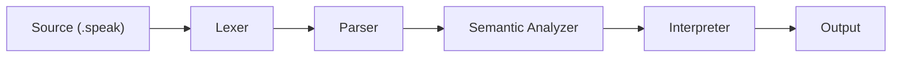

<p align="center">
  
</p>

<p align="center">
  <a href="https://github.com/krisvasoya/SpeakCode/releases"></a>
  <a href="https://github.com/krisvasoya/SpeakCode/stargazers"></a>
  <a href="https://github.com/krisvasoya/SpeakCode/forks"></a>
  <a href="LICENSE"></a>
  <a href="https://github.com/krisvasoya/SpeakCode/commits/main"></a>
  
  
</p>

<p align="center">
  <b>An English-like programming language and compiler — built from scratch in Python.</b><br/>
  Write code the way you speak. No curly braces. No semicolons. Just plain English.
</p>

<p align="center">
  <a href="#installation">Install</a> ·
  <a href="#quick-start">Quick Start</a> ·
  <a href="#language-reference">Language Reference</a> ·
  <a href="#cli-reference">CLI</a> ·
  <a href="#documentation">Docs</a> ·
  <a href="#contributing">Contributing</a>
</p>

---

## Table of Contents

- [Why SpeakCode?](#why-speakcode)
- [How it Compares](#how-it-compares)
- [Installation](#installation)
- [Quick Start](#quick-start)
- [Language Reference](#language-reference)
- [CLI Reference](#cli-reference)
- [Compiler Architecture](#compiler-architecture)
- [Project Structure](#project-structure)
- [Error Reference](#error-reference)
- [Roadmap](#roadmap)
- [Documentation](#documentation)
- [Contributing](#contributing)
- [FAQ](#faq)
- [Author](#author)
- [License](#license)

---

## Why SpeakCode?

Most programming languages require students to learn symbolic syntax — semicolons, curly braces, and mathematical notation — before they can write a single meaningful program. SpeakCode removes that barrier.

**SpeakCode is for:**
- Students learning programming concepts for the first time
- Educators building beginner coding workshops
- Compiler Design students who want a real, hand-written compiler to study

**SpeakCode is not for:**
- Production applications or backend systems
- Performance-critical or numerical computing
- Replacing general-purpose languages

---

## How it Compares

### Language Design

| Feature | C | Python | Java | **SpeakCode** |
|---|---|---|---|---|
| Syntax style | Symbolic | Indented | Object-oriented | Conversational English |
| Learning curve | Steep | Low | Medium | Very Low |
| Statement terminator | `;` | Newline | `;` | `.` (period) |
| Execution model | Native compiled | Bytecode VM | Bytecode VM | Tree-walking interpreter |
| Primary target | Systems | General | Enterprise | **Compiler education** |
| Natural English syntax | No | Partial | No | **Yes** |

### Code Side-by-Side

| Task | Python | SpeakCode |
|---|---|---|
| Print | `print("Hello")` | `Speak "Hello".` |
| Variable | `score = 10` | `Remember 10 as score.` |
| Update | `score += 5` | `Change score to score plus 5.` |
| Condition | `if age >= 18:` | `If age is at least 18 then` |
| Loop | `while x < 5:` | `While x is below 5 repeat` |
| Function | `def greet(name):` | `To perform greet with name:` |

---

## Installation

**Requirements:** Python 3.10, 3.11, or 3.12. No third-party packages needed.

```bash
# 1. Clone the repository
git clone https://github.com/krisvasoya/SpeakCode.git
cd SpeakCode
```

```bash
# 2a. Create a virtual environment (Windows)
python -m venv venv
.\venv\Scripts\activate

# 2b. Create a virtual environment (macOS / Linux)
python3 -m venv venv
source venv/bin/activate
```

```bash
# 3. Run the test suite to confirm everything works
python -m unittest discover -s tests
python test_runner.py
```

```bash
# 4. Verify the compiler
python speakcode.py version
```

---

## Quick Start

Create `hello.speak`:

```
Speak "Hello, SpeakCode!".
```

Run it:

```bash
python speakcode.py run hello.speak
```

Output:

```
Hello, SpeakCode!
```

---

## Language Reference

### Variables

```
Remember 10 as score.
Change score to score plus 5.
Speak score.
```

Output: `15`

Variables are declared with `Remember` and updated with `Change`. Redeclaring a variable in the same scope raises `SPK103`.

---

### Input & Output

```
Ask "Enter your name: " and save as name.
Speak "Welcome " plus name.
```

`Ask` reads from stdin. `Speak` prints to stdout.

---

### Conditionals

```
Remember 20 as age.
If age is at least 18 then
    Speak "Adult".
Otherwise
    Speak "Minor".
Finish checking.
```

Blocks open with `If … then` and close with `Finish checking.`

---

### Loops

```
Remember 1 as i.
While i is below 4 repeat
    Speak i.
    Change i to i plus 1.
Finish looping.
```

Output: `1  2  3`

Blocks open with `While … repeat` and close with `Finish looping.`

---

### Functions & Recursion

```
To perform count_down with n:
    If n is above 0 then
        Speak n.
        Perform count_down with n minus 1.
    Finish checking.
Finish performance.

Perform count_down with 3.
```

Output: `3  2  1`

Declared with `To perform`, called with `Perform`. Recursion is fully supported.

---

### Operators

| Operation | Syntax |
|---|---|
| Add | `x plus y` |
| Subtract | `x minus y` |
| Multiply | `x times y` |
| Divide | `x divided by y` |
| Equal | `x is equal to y` |
| Not equal | `x is not equal to y` |
| Greater | `x is above y` |
| Less | `x is below y` |
| Greater or equal | `x is at least y` |
| Less or equal | `x is at most y` |

---

## CLI Reference

```bash
python speakcode.py run <file>        # Execute a program
python speakcode.py tokens <file>     # Print the token stream
python speakcode.py ast <file>        # Print the Abstract Syntax Tree
python speakcode.py semantic <file>   # Run semantic analysis only
python speakcode.py explain <file>    # Translate code to plain English
python speakcode.py format <file>     # Format and normalize a file
python speakcode.py repl              # Start the interactive REPL
python speakcode.py version           # Print compiler version
```

---

## Compiler Architecture



| Stage | Module | Responsibility |
|---|---|---|
| **Lexer** | `speak_lexer.py` | Tokenizes source into a typed token stream |
| **Parser** | `speak_parser.py` | Recursive descent; builds the AST; panic-mode error recovery |
| **Semantic Analyzer** | `speak_semantic.py` | Scope resolution, type checking, function hoisting |
| **Interpreter** | `speak_interpreter.py` | Tree-walking execution with dynamic environments |

**Error recovery:** On a syntax error, the parser advances to the next `.` and continues parsing, so multiple errors are reported in one pass.

**Function hoisting:** All function declarations are registered globally before any statement executes, so functions can be called before they are defined in the file.

---

## Project Structure

```
SpeakCode/
├── speakcode.py           # CLI entry point
├── speak_lexer.py         # Lexical scanner
├── speak_parser.py        # Recursive descent parser
├── speak_ast.py           # AST node dataclasses
├── speak_semantic.py      # Scope and type analyzer
├── speak_interpreter.py   # Tree-walking interpreter
├── speak_errors.py        # Diagnostic exceptions
├── speak_tokens.py        # Token type definitions
├── speak_formatter.py     # Code normalizer
├── speak_explainer.py     # AST-to-English translator
├── examples/              # 17 runnable example programs
├── tests/                 # 75 unit and integration tests
└── docs/
    ├── Project_Report.md
    ├── API_Documentation.md
    ├── Developer_Guide.md
    ├── User_Manual.md
    └── Examples_Guide.md
```

---

## Error Reference

| Code | Type | Cause | Fix |
|---|---|---|---|
| `SPK101` | Lexical | Malformed number or illegal character | Remove invalid characters |
| `SPK102` | Syntax | Missing period or unclosed block | Add the missing `.` terminator |
| `SPK103` | Semantic | Variable declared twice in same scope | Use a unique variable name |
| `SPK104` | Semantic | Variable used before `Remember` | Declare the variable first |
| `SPK105` | Runtime | Division by zero | Validate divisor before dividing |
| `SPK106` | Semantic | Wrong number of function arguments | Match the parameter count |
| `SPK107` | Semantic | `Return` outside a function body | Move it inside a function |
| `SPK108` | Type | Operator applied to incompatible types | Keep operand types consistent |

---

## Roadmap

**v1.0.0** ✅ Released

- [x] Lexer, parser, AST, semantic analyzer, interpreter
- [x] REPL, CLI, formatter, explain mode
- [x] 75 tests · 17 example programs · full documentation

**v1.1.0** — Planned

- [ ] List and array support
- [ ] Index-based access (`item 1 of list`)
- [ ] String methods (`length of`, `reverse of`)

**v2.0.0** — Future

- [ ] Bytecode compilation target
- [ ] Custom virtual machine
- [ ] Module and import system
- [ ] Object types and methods

---

## Documentation

| Document | Description |
|---|---|
| [User Manual](docs/User_Manual.md) | Complete language syntax reference |
| [Developer Guide](docs/Developer_Guide.md) | How to extend the compiler |
| [API Documentation](docs/API_Documentation.md) | Internal module API reference |
| [Examples Guide](docs/Examples_Guide.md) | Walkthrough of all 17 example programs |
| [Project Report](docs/Project_Report.md) | Academic report with architecture diagrams |

---

## Contributing

Contributions are welcome. Please read these guidelines before opening a pull request.

**Setup:**

```bash
git clone https://github.com/krisvasoya/SpeakCode.git
cd SpeakCode
python -m unittest discover -s tests   # All 75 tests must pass
```

**Guidelines:**

- **Code style:** Follow [PEP 8](https://peps.python.org/pep-0008/). Add type annotations to all public functions.
- **Tests:** Every behavior change must include a corresponding test in `tests/`. PRs without tests will not be merged.
- **Commit messages:** Use conventional prefixes — `feat:`, `fix:`, `docs:`, `refactor:`, `test:`.
- **Branches:** Create branches from `main`. Name them `feat/description` or `fix/description`.

See [open issues](https://github.com/krisvasoya/SpeakCode/issues) for ideas.

---

## FAQ

<details>
<summary><b>Is SpeakCode compiled or interpreted?</b></summary>

It passes through a full compiler front end — lexer, recursive descent parser, and semantic analyzer — before being executed by a tree-walking interpreter. It is not compiled to native code or bytecode.
</details>

<details>
<summary><b>Why are periods (.) required at the end of statements?</b></summary>

Periods serve as statement terminators (replacing semicolons) and act as synchronization points for panic-mode error recovery in the parser.
</details>

<details>
<summary><b>How does the compiler handle syntax errors?</b></summary>

Using panic-mode synchronization. After an error, the parser logs it and advances to the next `.` or block-close keyword, then resumes. This means multiple errors are reported in a single pass.
</details>

<details>
<summary><b>What is function hoisting?</b></summary>

Before executing any statements, the semantic analyzer registers all function declarations globally. This allows functions to be called before they appear in the source file.
</details>

<details>
<summary><b>Does SpeakCode support recursion?</b></summary>

Yes. Functions defined with `To perform` support direct and mutual recursion.
</details>

<details>
<summary><b>Can I run SpeakCode interactively?</b></summary>

Yes. Run `python speakcode.py repl` to open the interactive multiline REPL console.
</details>

<details>
<summary><b>Why is the compiler written in Python?</b></summary>

Python's `dataclasses`, readable class model, and standard library make it ideal for writing an educational compiler that students can read, debug, and extend.
</details>

<details>
<summary><b>Can I import external files?</b></summary>

Not in v1.0. SpeakCode compiles single files only. Multi-file support is planned for v1.1.
</details>

---

## Author

<p align="center">
  <a href="https://github.com/krisvasoya">
    
  </a>
</p>

<p align="center">
  <b>Krish Vasoya</b><br/>
  B.Tech Computer Science &amp; Design, 2026<br/>
  <br/>
  <a href="https://github.com/krisvasoya"></a>
  <a href="https://linkedin.com"></a>
</p>

---

## License

MIT License. See [LICENSE](LICENSE) for details.

---

<p align="center">
  <sub>Built with Python · MIT License · <a href="https://github.com/krisvasoya/SpeakCode">github.com/krisvasoya/SpeakCode</a></sub>
</p>
