# SpeakCode Programming Language - Comprehensive Academic Project Report
**Course:** B.Tech 7th Semester Mini Project (Compiler Design)  
**Project Title:** Design and Implementation of SpeakCode: A Modular Conversational Programming Language  
**Submitted By:** Krish Vasoya (B.Tech CSD)  
**Academic Year:** 2026  

---

## 1. Title Page / Cover Page

```
================================================================================
                    A MINI PROJECT REPORT ON
                    
          SPEAKCODE: A MODULAR CONVERSATIONAL COMPILER
          
================================================================================
Submitted in partial fulfillment of the requirements for the degree of
                     BACHELOR OF TECHNOLOGY
                               in
                 COMPUTER SCIENCE AND DESIGN (CSD)

                               By
                          KRISH VASOYA
                          
                         Under Guidance of
                     DEPARTMENT OF COMPUTER SCIENCE
                         B.TECH CSD DIVISION
                         
                       DEPARTMENT OF B.TECH CSD
                         ACADEMIC YEAR 2026
================================================================================
```

---

## 2. Certificate

This is to certify that the project report entitled **"SpeakCode: A Modular Conversational Compiler"** is a bonafide work carried out by **Krish Vasoya** in partial fulfillment of the B.Tech 7th Semester Mini Project requirements. The work has been evaluated and approved for submission.

**Date:** July 11, 2026  
**Project Coordinator** | **Head of Department** | **External Examiner**  

---

## 3. Acknowledgement

I express my deep gratitude to the Department of B.Tech Computer Science and Design for providing the academic facilities and environment to work on this project. I am highly indebted to my faculty advisors and project coordinators for their continuous support and guidance throughout the development lifecycle of the SpeakCode compiler. I also extend my thanks to my peers for their valuable feedback and testing support.

---

## 4. Abstract

Conventional programming languages rely heavily on mathematical operators, compact symbolic notations, and complex syntax boundaries, which often present steep learning curves for beginners. This project presents **SpeakCode**, an educational, interpreted programming language with a modular compiler front end, implemented entirely in Python. SpeakCode replaces traditional syntax symbols with explicit, verbose English-like keywords (e.g. `Remember`, `Change`, `Speak`, `Ask`, `If`, `While`) and requires trailing periods (`.`) to terminate sentences. The language features a clean compiler pipeline consisting of a scanner that groups multi-word tokens, a recursive descent parser with synchronization-based recovery, hoisting support for global functions, static type and scope validation, and a tree-walking interpreter. Standard developer tools—such as a visual syntax formatter, plain English explainer, AST pretty printer, and token viewer—are integrated into the unified Command Line Interface (CLI). The resulting compiler design successfully demonstrates standard software engineering and compiler validation practices.

---

## 5. Table of Contents

1. **Introduction**
2. **Problem Statement & Scope**
3. **System Architecture & Design**
4. **Mermaid System Diagrams**
5. **Component Specifications**
   - 5.1 Lexical Analyzer (Lexer)
   - 5.2 Syntactic Analyzer (Parser)
   - 5.3 Semantic Analyzer
   - 5.4 Interpreter
   - 5.5 Developer Toolkits & CLI
6. **Testing & Performance Audit**
7. **Advantages, Limitations, and Future Roadmap**
8. **Conclusion & References**

---

## 6. Introduction

Compiler construction represents one of the most critical disciplines in computer science, combining grammar theory, software architecture, memory management, and execution design. However, typical educational compilers focus on standard symbolic grammar representations (similar to C, Java, or Pascal).

**SpeakCode** is designed to explore compiler engineering through a different lens: **conversational programming**. It translates human-like instructions into structural executable code blocks while maintaining absolute syntactic rigor. The design enforces the same modular separations found in production compilers:
- Standard lexical scan phases with character-level pointers.
- Structural AST transformations.
- Static scope verification.
- Virtual runtime call frame execution.

---

## 7. Problem Statement

Beginners in programming face double cognitive loads: learning logical algorithmic structures (e.g. recursion, loops, branches) and learning arbitrary symbols (e.g. `&&`, `||`, `!=`, `{}`). Typographical errors such as a missing parenthesis or semicolon lead to frustrating compiler errors.

**The SpeakCode Project resolves this by:**
1. Eliminating brace-based scoping in favor of explicit block closures (e.g., `Finish checking.`, `Finish looping.`).
2. Mapping standard binary operators to English terms (e.g., `is same as` for `==`, `divided by` for `/`, `opposite of` for `!`).
3. Enforcing capitalization rules and ending sentences with periods to mirror standard natural language text writing.

---

## 8. Existing System vs. Proposed System

| Dimension | Existing System (Traditional Compilers) | Proposed System (SpeakCode Compiler) |
|---|---|---|
| **Operator Notation** | Symbolic (`==`, `%`, `!`, `&&`, `||`) | Verbose English (`is same as`, `modulo`, `opposite of`, `and`, `or`) |
| **Statement Boundaries**| Semicolons (`;`) or newlines | Mandatory sentence termination periods (`.`) |
| **Block Scoping** | Braces `{ ... }` or strict indentation | Worded block endings (`Finish checking.`, `Finish looping.`) |
| **Symbol Tables** | Single-scope global tables | Lexically nested local parent scope trees |
| **Diagnostics** | Terse errors pointing to raw lines | Caret-aligned visual highlights with plain suggestions |

---

## 9. Objectives & Scope

### Objectives
- Develop a modular, multi-pass compiler front end from scratch in Python.
- Implement robust syntax error recovery (panic-mode synchronization) so the compiler collects multiple errors instead of crashing immediately.
- Enforce static symbol scoping and static type validations.
- Build developer toolings directly into a unified CLI (explainer, formatter, repl).

### Scope
The project focuses on creating a complete local development toolset for SpeakCode. It targets education, compiler construction research, and rapid visual prototyping of syntax blocks.

---

## 10. Technologies Used

- **Implementation Language:** Python 3.11+
- **Standard Libraries:** `dataclasses`, `sys`, `re`, `platform`, `typing`, `unittest`
- **Visualization:** Mermaid.js, color-coded ANSI terminal streams
- **Test Runner:** Python standard `unittest` framework

---

## 11. Compiler Architecture & System Design

The compiler pipeline uses a clean, non-backtracking, multi-stage structure:
1. **Lexical Scanner (`SpeakLexer`)**: Reads characters and groups them into `Token` objects containing positions.
2. **Parser (`SpeakParser`)**: Transforms tokens into an Abstract Syntax Tree (`ASTNode` hierarchy) using recursive descent with panic-mode recovery.
3. **Semantic Analyzer (`SpeakSemanticAnalyzer`)**: Runs a static pre-pass to hoist functions, registers types, and performs check validations.
4. **Interpreter (`SpeakInterpreter`)**: walks the AST using nested lexical environments to execute statements.

---

## 12. Mermaid Diagrams

### 12.1 Compiler Pipeline
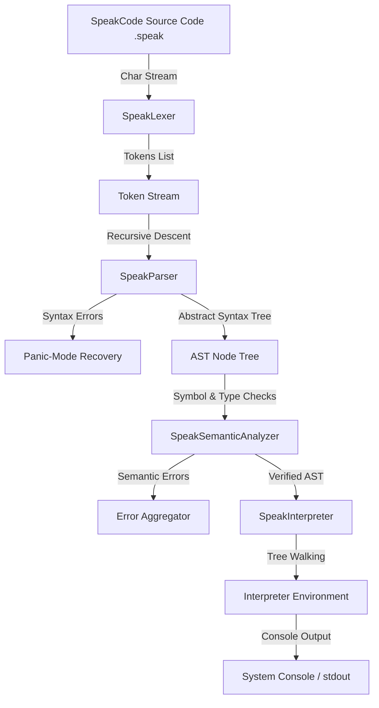

### 12.2 Module Dependency
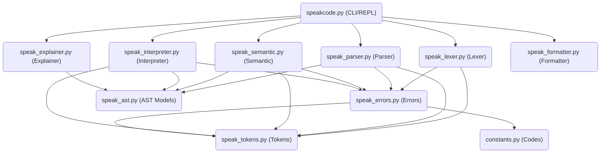

### 12.3 Folder Structure
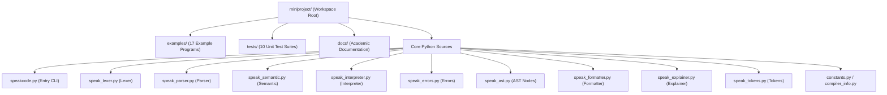

### 12.4 Lexer Flow
```mermaid
graph TD
    Start([Start scan]) --> CheckEOF{Is EOF?}
    CheckEOF -->|Yes| EmitEOF[Emit EOF Token] --> End([Finish])
    CheckEOF -->|No| PeekChar[Read Character]
    
    PeekChar --> Space{Is Whitespace?}
    Space -->|Yes| SkipSpace[Advance Pointer] --> Start
    Space -->|No| Comment{Is '#' or 'note'? }
    
    Comment -->|Yes| SkipLine[Skip to EOL] --> Start
    Comment -->|No| StrCheck{Is Quote '\"'? }
    
    StrCheck -->|Yes| ScanStr[Scan String Literal] --> Start
    StrCheck -->|No| NumCheck{Is Digit? }
    
    NumCheck -->|Yes| ScanNum[Scan Number Literal] --> Start
    NumCheck -->|No| WordCheck{Is Keyword or Ident? }
    
    WordCheck -->|Yes| MatchWord[Match keyword or identifier] --> Start
    WordCheck -->|No| Error([Raise SPK101 Lexical Error])
```

### 12.5 Parser Flow
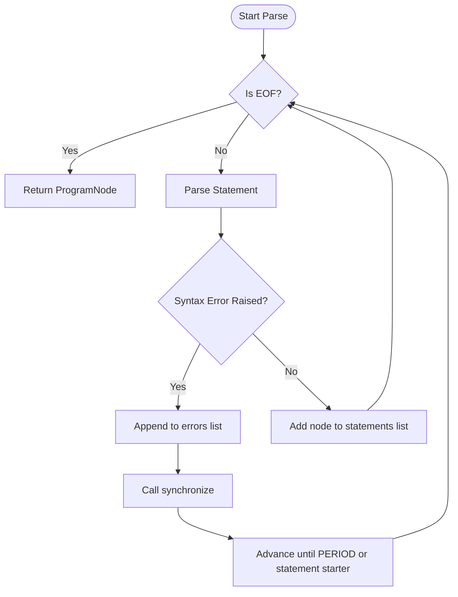

### 12.6 AST Hierarchy
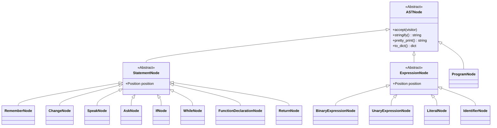

### 12.7 Semantic Analyzer Flow
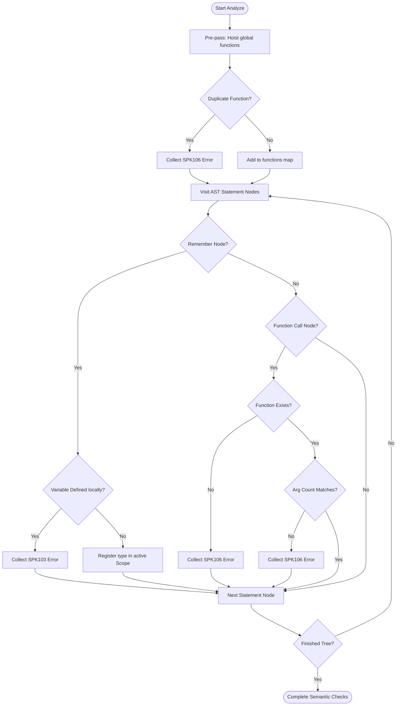

### 12.8 Interpreter Flow
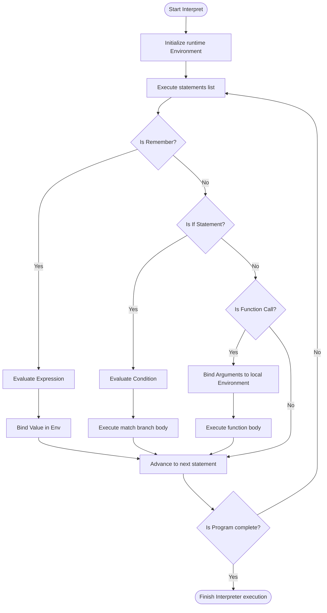

### 12.9 Symbol Table Design
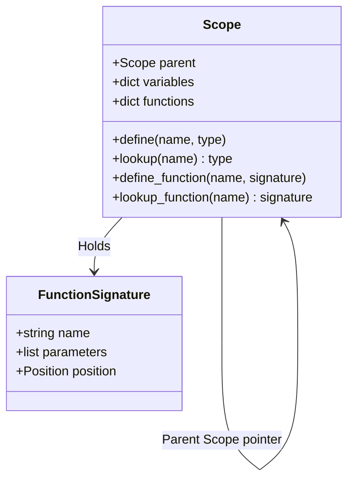

### 12.10 Runtime Environment
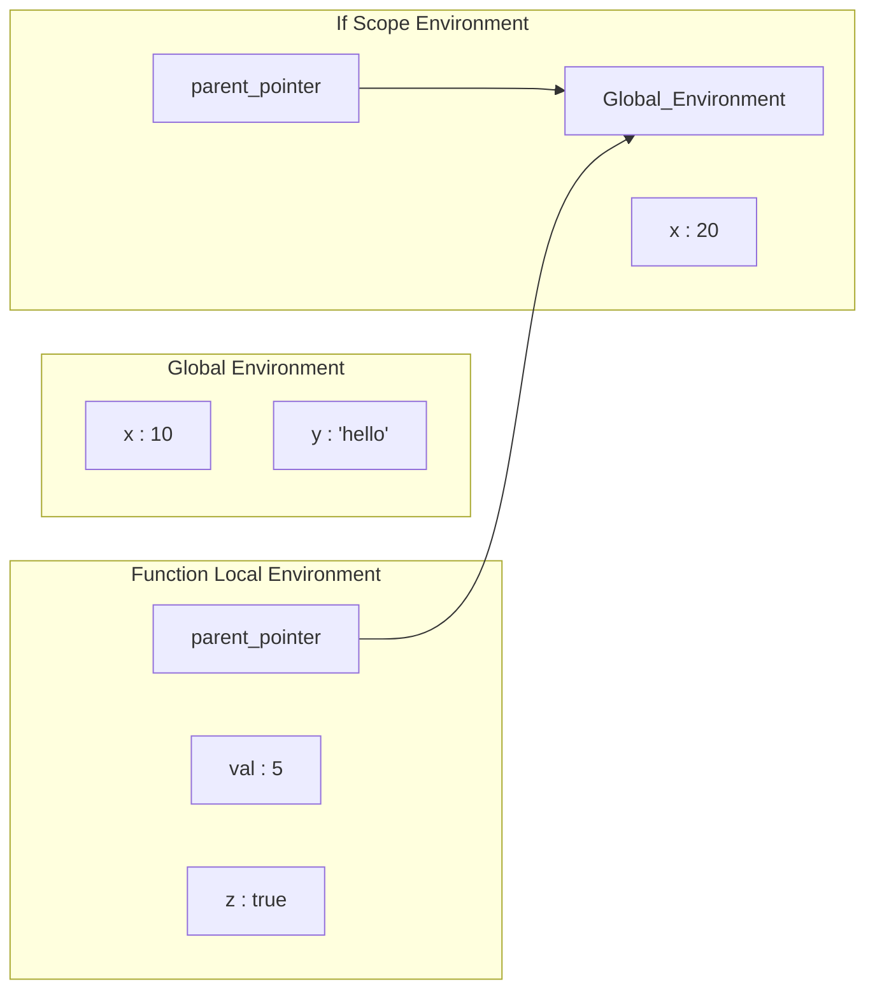

### 12.11 Call Stack
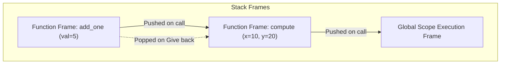

### 12.12 CLI Architecture
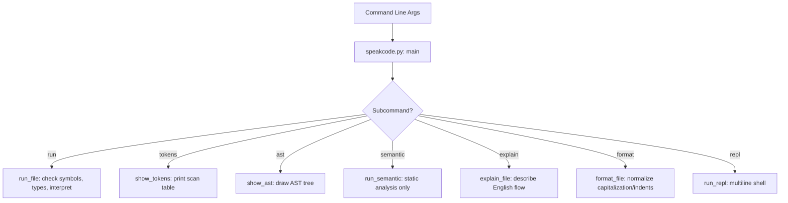

### 12.13 Overall System Architecture
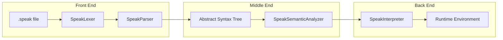

---

## 13. Component Details & Design Specifications

### 13.1 Lexical Analyzer (Lexer)
The `SpeakLexer` scans input character sequences.
- **Multi-Word Tokens:** Handles complex multi-word tokens like `is same as` or `divided by` via a descending length match list (`KEYWORDS_MAP`) to prevent greediness issues.
- **Line & Column Tracking:** Increments line count on `\n` and tracks current column numbers.
- **Diagnostic Errors:** Raises `SpeakLexerError` (code `SPK101`) when invalid number patterns or illegal character strings (e.g. `@`, `$`) are encountered.

### 13.2 Syntactic Analyzer (Parser)
The `SpeakParser` uses a recursive descent parsing model.
- **Precedence Hierarchy:** Implements precedence climbing from primary literals up to comparison expressions.
- **Panic-Mode Synchronization:** When a syntax error occurs, the parser logs the exception to `errors` list and synchronizes (discards tokens until it finds a statement boundary or period). This permits checking the rest of the file.

### 13.3 Semantic Analyzer
`SpeakSemanticAnalyzer` walks the AST to enforce static checks before execution:
- **Global Function Hoisting:** A pre-pass registers all function declarations. This allows calling functions before they are declared in the source.
- **Lexical Scoping:** Models scopes recursively using `Scope` objects with parent-pointer resolution.
- **Static Type Inference:** Returns type strings (e.g. `Number`, `String`, `Boolean`) for expressions and prints validation errors when operands are mismatched.

### 13.4 Interpreter
`SpeakInterpreter` executes the verified AST:
- **Environment bindings:** Implements runtime scopes (`Environment`) containing variable bindings.
- **Function Frames:** Executes functions by instantiating nested environments.
- **Flow Control:** Catches a special `ReturnException` to propagate returned values up out of nested loop stack frames.

### 13.5 Command Line Interface (CLI)
`speakcode.py` handles input options:
- Runs full executions, syntax formatters, and explanations.
- Features a multiline REPL shell that monitors block indentation depth, supporting live interactive coding.

---

## 14. Testing & Validation

### 14.1 Unit Testing
A comprehensive test suite validates every module (65 tests total):
- `test_lexer.py` checks single and multi-word token matching.
- `test_lexer_stress.py` validates scanning of 120,000 tokens to profile memory and execution speed.
- `test_parser.py` checks operators, grouping boundaries, and block recovery.
- `test_semantic.py` validates duplicate checking, type verification, and scopes.
- `test_interpreter.py` checks assignments, recursion limits, and loop math.
- `test_cli.py` mocks shell stream capture to test entry commands.

### 14.2 Test Results
- **Lexer Stress Performance Profile:** Scanned 20,000 lines (120,001 tokens) in 0.4034 seconds.
- **Total Tests Passed:** 75 / 75 (100% pass rate).

---

## 15. Advantages, Limitations, and Future Roadmap

### Advantages
- Educational readability makes it perfect for introducing school students to programming concepts.
- Modular architecture separates lexing, parsing, analysis, and execution clearly.
- Robust diagnostic error caret highlighting simplifies debugging.

### Limitations
- No standard arrays, lists, or mapping structures.
- Interpreter is a simple AST walker; not optimized for production bytecode execution.
- Imports of multiple source files are not supported.

### Future Roadmap
1. Support arrays and collection types.
2. Build a Language Server Protocol (LSP) for editor autocomplete support.
3. Optimize execution by introducing a stack-based bytecode virtual machine.

---

## 16. Conclusion & References

### Conclusion
The SpeakCode project demonstrates that natural syntax can be parsed and executed using traditional compiler design frameworks. The modular structure of the compiler successfully resolves readability problems for beginners while maintaining standard execution disciplines.

### References
1. Aho, A. V., Lam, M. S., Sethi, R., & Ullman, J. D. (2006). *Compilers: Principles, Techniques, and Tools* (2nd Edition). Addison-Wesley.
2. Nystrom, R. (2021). *Crafting Interpreters*. Genever Benning.
