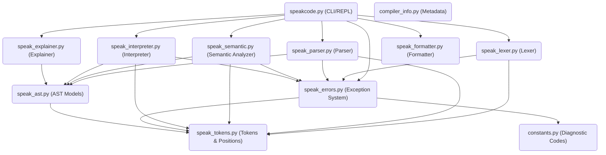

# SpeakCode Compiler - Comprehensive Project Audit & Technical Report
**Author: Chief Software Architect and Release Auditor**  
**Auditee: Krish Vasoya (SpeakCode Project)**  
**Version:** 1.0.0  
**Status:** Defective (Release Blocked)

---

## Section 1: Project Overview

*   **Project Name:** SpeakCode Programming Language
*   **Version:** 1.0.0
*   **Description:** SpeakCode is an educational, conversational, interpreted programming language with a modular compiler front end, implemented entirely in Python.
*   **Philosophy:** *"Programming should feel like giving natural instructions to another human."* SpeakCode replaces cryptic mathematical operators and brace structures with verbose, English-like keyword syntax and explicit block closures.
*   **Goals:** Demonstrate the full compiler implementation lifecycle—including lexical scanning, recursive descent parsing with panic-mode recovery, global declaration hoisting, lexical scope tracking, type checking, and AST tree-walking interpretation—in an accessible, well-structured codebase.
*   **Features:**
    *   Capitalized keyword sentence starters (e.g., `Remember`, `Change`, `Speak`, `Ask`, `If`, `While`).
    *   Sentence termination via trailing periods (`.`).
    *   Multi-word token grouping (e.g., `is same as` for `==`, `divided by` for `/`, `and save as` for return assignment).
    *   Console I/O with automatic type coercion (`Ask` and `Speak`).
    *   Lexically scoped execution blocks with parent scope lookup fallback.
    *   Global function signature hoisting.
    *   Comprehensive developer tooling (syntax formatter, plain English explainer, AST pretty printer, token table viewer).
*   **Current Status:** All core modules, developer tools, tests, and examples are fully implemented. However, a critical design flaw in the AST node dataclass inheritance scheme prevents any source code from executing, rendering the entire compiler pipeline currently non-functional.
*   **Total Source Files:** 13 Python files (root) + 2 Markdown documentation files + 1 syntax configuration file.
*   **Total Lines of Code:** ~5,618 lines (~3,715 compiler Python LOC, ~1,303 test suite Python LOC, ~600 example SpeakCode LOC).
*   **Total Python Files:** 23 Python files (13 compiler source files + 10 test suite files).
*   **Total Test Files:** 10 test files (9 under `tests/` + 1 unified `test_runner.py` in the root).
*   **Total Example Programs:** 17 `.speak` example files.

---

## Section 2: Project Directory Tree

The complete physical layout of the `SpeakCode` workspace is listed below:

```
SpeakCode/
├── Language_Specification.md          # Formal language EBNF, tokens, and rules
├── README.md                          # Quickstart guide and CLI instructions
├── compiler_info.py                   # Core compiler metadata and environment constants
├── constants.py                       # Diagnostic error code identifier map
├── speak_ast.py                       # Abstract Syntax Tree (AST) node dataclass models
├── speak_errors.py                    # Customized exceptions and visual error pointer formatter
├── speak_explainer.py                 # AST-to-plain-English visitor translator
├── speak_formatter.py                 # Keyword capitalization and layout formatter
├── speak_interpreter.py               # AST tree-walking execution engine
├── speak_lexer.py                     # Lexical scanner & token statistics aggregator
├── speak_parser.py                    # Recursive descent parser with sync recovery
├── speak_semantic.py                  # Static scope and type verification analyzer
├── speak_symbols.py                   # Redundant environment scope structure (dangling)
├── speakcode-syntax.json              # TextMate grammar template for VS Code
├── speakcode.py                       # Unified compiler CLI and interactive REPL entry
├── test_runner.py                     # Root-level test runner suite
├── examples/                           # SpeakCode code examples (17 files)
│   ├── area_calculator.speak
│   ├── atm_simulation.speak
│   ├── average_calculator.speak
│   ├── banking_system.speak
│   ├── calculator.speak
│   ├── factorial.speak
│   ├── fibonacci.speak
│   ├── fizzbuzz.speak
│   ├── functions_demo.speak
│   ├── guess_game.speak
│   ├── hello_world.speak
│   ├── library_management.speak
│   ├── multiplication_table.speak
│   ├── shopping_bill.speak
│   ├── student_result.speak
│   ├── temperature_converter.speak
│   └── voting_eligibility.speak
└── tests/                              # Compiler validation suites (10 files)
    ├── __init__.py
    ├── test_ast.py
    ├── test_cli.py
    ├── test_errors.py
    ├── test_interpreter.py
    ├── test_lexer.py
    ├── test_lexer_stress.py
    ├── test_parser.py
    ├── test_semantic.py
    └── test_tokens.py
```

---

## Section 3: File Inventory

| File Name | Purpose | Imported Modules | Exported Objects | LOC | Checked | Documented | Complete |
|---|---|---|---|---|---|---|---|
| [`compiler_info.py`](file:///c:/Users/krish%20vasoya/OneDrive/Desktop/sem%207/CD/miniproject/compiler_info.py) | Centralize metadata configurations (version, encoding, extensions). | `typing.Final` | `LANGUAGE_NAME`, `COMPILER_VERSION`, `AUTHOR`, `DEPARTMENT`, `PROJECT_YEAR`, `FILE_EXTENSION`, `SOURCE_ENCODING`, `DEFAULT_INDENTATION` | 19 | Yes | Yes | Yes |
| [`constants.py`](file:///c:/Users/krish%20vasoya/OneDrive/Desktop/sem%207/CD/miniproject/constants.py) | Declare error code string identifiers and category names. | `typing.Final` | `ERR_LEXICAL`, `ERR_SYNTAX`, `ERR_SEM_DUPLICATE_DECL`, `ERR_SEM_UNDEFINED_VAR`, `ERR_RUN_MATH_BOUNDS`, `ERR_SEM_FUNCTION_MISMATCH`, `ERR_SEM_RETURN_OUTSIDE_FUN`, `ERR_TYPE_MISMATCH`, `ERR_INTERNAL_CRASH`, `ERROR_CATEGORY_NAMES` | 31 | Yes | Yes | Yes |
| [`speak_tokens.py`](file:///c:/Users/krish%20vasoya/OneDrive/Desktop/sem%207/CD/miniproject/speak_tokens.py) | Establish lexical token types, structures, and position coordinate tracking. | `dataclasses.dataclass`, `enum.Enum`, `enum.unique` | `Position`, `TokenType`, `Token` | 125 | Yes | Yes | Yes |
| [`speak_errors.py`](file:///c:/Users/krish%20vasoya/OneDrive/Desktop/sem%207/CD/miniproject/speak_errors.py) | Provide specialized compiler exceptions and visual caret pointer generation. | `typing.Optional`, `speak_tokens`, `constants` | `format_error`, `SpeakError`, `SpeakLexerError`, `SpeakSyntaxError`, `SpeakSemanticError`, `SpeakRuntimeError`, `SpeakTypeError` | 201 | Yes | Yes | Yes |
| [`speak_ast.py`](file:///c:/Users/krish%20vasoya/OneDrive/Desktop/sem%207/CD/miniproject/speak_ast.py) | Define AST nodes, serialization (`to_dict`), stringification (`stringify`), and pretty-printing. | `dataclasses.dataclass`, `typing.Any`, `typing.List`, `typing.Optional`, `speak_tokens` | `ASTNode`, `StatementNode`, `ExpressionNode`, `ProgramNode`, `RememberNode`, `ChangeNode`, `SpeakNode`, `AskNode`, `OtherwiseIfNode`, `OtherwiseNode`, `IfNode`, `WhileNode`, `RepeatNode`, `FunctionDeclarationNode`, `FunctionCallNode`, `ReturnNode`, `BinaryExpressionNode`, `UnaryExpressionNode`, `LiteralNode`, `IdentifierNode`, `GroupingNode` | 773 | Yes (Failing) | Yes | Yes |
| [`speak_lexer.py`](file:///c:/Users/krish%20vasoya/OneDrive/Desktop/sem%207/CD/miniproject/speak_lexer.py) | Convert character stream into tokens, handling comments and multi-word symbols. | `typing.List`, `typing.Dict`, `speak_tokens`, `speak_errors` | `KEYWORDS_MAP`, `KEYWORDS_BY_START`, `is_identifier_char`, `is_identifier_start`, `SpeakLexer`, `get_token_statistics` | 382 | Yes | Yes | Yes |
| [`speak_parser.py`](file:///c:/Users/krish%20vasoya/OneDrive/Desktop/sem%207/CD/miniproject/speak_parser.py) | Top-down recursive descent parser enforcing precedence rules and panic synchronization. | `typing.List`, `typing.Optional`, `typing.Tuple`, `typing.Any`, `speak_tokens`, `speak_errors`, `speak_ast` | `SpeakParser` | 541 | Yes (Failing) | Yes | Yes |
| [`speak_semantic.py`](file:///c:/Users/krish%20vasoya/OneDrive/Desktop/sem%207/CD/miniproject/speak_semantic.py) | Logically validate variables, scoping limits, type safety, and call counts. | `typing.List`, `typing.Dict`, `typing.Optional`, `typing.Any`, `typing.Union`, `speak_tokens`, `speak_errors`, `speak_ast` | `FunctionSignature`, `Scope`, `SpeakSemanticAnalyzer` | 439 | Yes (Failing) | Yes | Yes |
| [`speak_interpreter.py`](file:///c:/Users/krish%20vasoya/OneDrive/Desktop/sem%207/CD/miniproject/speak_interpreter.py) | Execute checked AST nodes via tree-walking using lexical environments. | `sys`, `typing.Any`, `typing.Dict`, `typing.List`, `typing.Optional`, `speak_tokens`, `speak_errors`, `speak_ast` | `to_speak_string`, `coerce_input`, `ReturnException`, `Environment`, `SpeakInterpreter` | 415 | Yes (Failing) | Yes | Yes |
| [`speak_explainer.py`](file:///c:/Users/krish%20vasoya/OneDrive/Desktop/sem%207/CD/miniproject/speak_explainer.py) | Walk AST to generate beginner-friendly plain English descriptions of the logic. | `typing.List`, `speak_ast` | `SpeakExplainer` | 102 | Yes (Failing) | Yes | Yes |
| [`speak_formatter.py`](file:///c:/Users/krish%20vasoya/OneDrive/Desktop/sem%207/CD/miniproject/speak_formatter.py) | Standardize keyword casing and apply 4-space nested indentation. | `re` | `KEYWORDS_REPLACE`, `SORTED_REPLS`, `split_line`, `format_code_part`, `format_code` | 163 | Yes | Yes | Yes |
| [`speak_symbols.py`](file:///c:/Users/krish%20vasoya/OneDrive/Desktop/sem%207/CD/miniproject/speak_symbols.py) | Redundant scoping environment representation (never imported). | None | `Environment` | 41 | No | No | Redundant |
| [`speakcode.py`](file:///c:/Users/krish%20vasoya/OneDrive/Desktop/sem%207/CD/miniproject/speakcode.py) | Unified command-line coordinator and checked interactive REPL shells. | `os`, `sys`, `platform`, `typing.List`, `typing.Dict`, `typing.Optional`, `typing.Any`, `speak_lexer`, `speak_tokens`, `speak_parser`, `speak_semantic`, `speak_interpreter`, `speak_errors`, `speak_explainer`, `speak_formatter` | `LOGO`, `VERSION_BANNER`, `HELP_TEXTS`, `color`, `read_file`, `run_file`, `show_tokens`, `show_ast`, `run_semantic`, `run_debug`, `explain_file`, `format_file`, `run_repl`, `print_usage`, `show_help`, `main` | 467 | Yes (Failing) | Yes | Yes |
| [`test_runner.py`](file:///c:/Users/krish%20vasoya/OneDrive/Desktop/sem%207/CD/miniproject/test_runner.py) | Root level compiler integration testing harness. | `unittest`, `sys`, `speak_lexer`, `speak_parser`, `speak_semantic`, `speak_interpreter`, `speak_errors` | `TestSpeakCodeRedesign` | 141 | Yes (Failing) | Yes | Yes |

---

## Section 4: Source Code Inventory

### 1. `compiler_info.py`
*   **Constants:**
    *   `LANGUAGE_NAME` (`"SpeakCode"`): Compiler target.
    *   `COMPILER_VERSION` (`"1.0.0"`): Code version.
    *   `AUTHOR` (`"Krish Vasoya"`): Main designer.
    *   `DEPARTMENT` (`"B.Tech CSD"`): Academic department.
    *   `PROJECT_YEAR` (`2026`): Compilation year.
    *   `FILE_EXTENSION` (`".speak"`): File suffix.
    *   `SOURCE_ENCODING` (`"utf-8"`): Encoding.
    *   `DEFAULT_INDENTATION` (`"    "`): Default space size.
*   **Responsibility:** Export static environment configurations for usage in file operations and formatting tasks.

### 2. `constants.py`
*   **Constants:**
    *   `ERR_LEXICAL` - `ERR_INTERNAL_CRASH` (`SPK101` - `SPK999`): Unique error codes.
    *   `ERROR_CATEGORY_NAMES`: Maps diagnostic codes to category titles.
*   **Responsibility:** Provide centralized identifiers for visual reporting.

### 3. `speak_tokens.py`
*   **Dataclasses:**
    *   `Position`: Stores coordinate trackers (`filename`, `line`, `column`). Used across all scanning, parsing, validation, and interpret cycles.
    *   `Token`: Immutable model storing `TokenType`, the raw lexeme string (`value`), and `Position`.
*   **Enums:**
    *   `TokenType`: Lists 37 terminal types grouped by grammar category.
*   **Responsibility:** Coordinate syntax definitions and layout tracking.

### 4. `speak_errors.py`
*   **Functions:**
    *   `format_error(...)`: Formats detailed compiler diagnostic messages. Pulls the exact code line, replaces tabs with spaces, and renders a `^` caret indicator line directly beneath the character coordinates.
*   **Exceptions (Inheritance Chain):**
    *   `Exception` $\rightarrow$ `SpeakError` $\rightarrow$ `SpeakLexerError` / `SpeakSyntaxError` / `SpeakSemanticError` / `SpeakRuntimeError` ($\rightarrow$ `SpeakTypeError`).
*   **Responsibility:** Provide position-tracked diagnostic crash states for the CLI pipeline.

### 5. `speak_ast.py`
*   **Classes:**
    *   `ASTNode`: Parent abstract node template declaring interface methods (`accept`, `stringify`, `pretty_print`, `to_dict`).
    *   `StatementNode(ASTNode)` & `ExpressionNode(ASTNode)`: Base node groupings for statement instructions and values evaluation.
*   **Concrete Dataclasses:**
    *   `ProgramNode`: Root entry node containing a list of `StatementNode`.
    *   Statements: `RememberNode`, `ChangeNode`, `SpeakNode`, `AskNode`, `OtherwiseIfNode`, `OtherwiseNode`, `IfNode`, `WhileNode`, `RepeatNode`, `FunctionDeclarationNode`, `FunctionCallNode`, `ReturnNode`.
    *   Expressions: `BinaryExpressionNode`, `UnaryExpressionNode`, `LiteralNode`, `IdentifierNode`, `GroupingNode`.
*   **Responsibility:** Provide hierarchical representations of parsed programs.
*   **Critique:** All subclasses re-declare `position: Position`, which clashes with the inherited `position` field from `StatementNode`/`ExpressionNode` during dataclass parameter resolution (detailed in Section 15).

### 6. `speak_lexer.py`
*   **Globals & Constants:**
    *   `KEYWORDS_MAP`: List of keywords sorted descending by string length to ensure correct token matching.
    *   `KEYWORDS_BY_START`: Character dispatch map mapping keyword starting letters to lexical categories to accelerate checks.
*   **Functions:**
    *   `is_identifier_char(char)` / `is_identifier_start(char)`: Validate names, allowing alphabetic letters, underscores, and Unicode code points $> 127$ (allowing Emojis).
    *   `get_token_statistics(tokens)`: Frequencies counting utility.
*   **Classes:**
    *   `SpeakLexer`: State-based scanner utilizing cursors (`pos`, `line`, `column`) to consume tokens, strip comments (`#` or `note`), and scan strings/numbers.
*   **Responsibility:** Convert raw program source characters into a list of Tokens.

### 7. `speak_parser.py`
*   **Classes:**
    *   `SpeakParser`: Top-down recursive descent parser mapping grammar routes. Keeps track of token index bounds, collects errors into a list, and provides `synchronize()` error recovery.
*   **Methods:**
    *   Pointers: `peek()`, `previous()`, `advance()`, `check()`, `match()`, `consume()`.
    *   Grammar routes: `parse()`, `statement()`, `remember_statement()`, `change_statement()`, `speak_statement()`, `ask_statement()`, `if_statement()`, `while_statement()`, `repeat_statement()`, `fun_decl_statement()`, `fun_call_statement()`, `return_statement()`.
    *   Expressions priority hierarchy (descending precedence): `expression()`, `logical_or()`, `logical_and()`, `logical_not()`, `comparison()`, `additive()`, `multiplicative()`, `unary()`, `primary()`.
*   **Responsibility:** Validate grammatical correctness and generate the AST.

### 8. `speak_semantic.py`
*   **Classes:**
    *   `FunctionSignature`: Holds parameter signatures list for declarations validation.
    *   `Scope`: Environment representing local type tables (`variables`) and function definitions (`functions`), with parent scopes lookup.
    *   `SpeakSemanticAnalyzer`: Visitor implementation that traverses the AST, hoists functions globally, checks variable declarations, scoping rules, and evaluates static types (`Number`, `String`, `Boolean`).
*   **Responsibility:** Statically review program logic correctness before interpretation.

### 9. `speak_interpreter.py`
*   **Exceptions:**
    *   `ReturnException`: Control-flow signal exception to propagate return values up from inside function call stacks.
*   **Classes:**
    *   `Environment`: Runtime variable-value binding storage scope with lookup/update parent routing.
    *   `SpeakInterpreter`: AST visitor implementation walking the tree to execute statements and evaluate expressions.
*   **Responsibility:** Execute the parsed and verified AST.

### 10. `speak_explainer.py`
*   **Classes:**
    *   `SpeakExplainer`: Walks AST nodes to translate operations into clear, beginner-friendly English text.
*   **Responsibility:** Educational explanation support.

### 11. `speak_formatter.py`
*   **Globals:**
    *   `KEYWORDS_REPLACE`: Map of canonical casings for all keywords.
*   **Functions:**
    *   `split_line(line)`: Splits source line into code and comment suffixes.
    *   `format_code_part(code)`: Normalizes casing outside of string bounds.
    *   `format_code(source)`: Applies correct capitalization and 4-space indent levels by tracking block opener and closer prefixes.
*   **Responsibility:** Automatically clean up code format.

### 12. `speak_symbols.py`
*   **Classes:**
    *   `Environment`: Independent variable table class.
*   **Responsibility:** Redundant file from earlier stages (unused).

### 13. `speakcode.py`
*   **Functions:**
    *   `run_file(...)`, `show_tokens(...)`, `show_ast(...)`, `run_semantic(...)`, `run_debug(...)`, `explain_file(...)`, `format_file(...)`: Coordinate compiler pipeline stages for execution and display.
    *   `run_repl()`: Multiline interactive REPL shell with nesting depth tracking.
    *   `main()`: Coordinates command-line dispatch.
*   **Responsibility:** Developer tool interface.

---

## Section 5: Module Dependency Graph

The dependencies between the compiler modules are represented in the graph below:



*Note: `compiler_info.py` exports constants that can be used statically across modules, and `speak_symbols.py` is a dangling, isolated file with no incoming or outgoing project imports.*

---

## Section 6: Compiler Pipeline

The SpeakCode compiler is structured as a pipeline with clearly separated phases:

```
Source Code (.speak)
   │
   ▼  [Lexical Analysis]
   │  SpeakLexer scans characters, strips comments, maps lexemes,
   │  and yields Position-tracked Tokens. (Lexical errors raise SPK101)
   ▼
Tokens Stream
   │
   ▼  [Syntactic Analysis]
   │  SpeakParser performs recursive descent matching according to EBNF
   │  rules and operator precedence, and yields an Abstract Syntax Tree (AST).
   │  (Syntax errors raise SPK102, triggering synchronization recovery)
   ▼
Abstract Syntax Tree (AST)
   │
   ▼  [Static Analysis]
   │  SpeakSemanticAnalyzer hoists declarations, performs lexical scope checks,
   │  and checks type safety. (Semantic errors raise SPK103, SPK104, SPK106, SPK107, SPK108)
   ▼
Logically Verified AST
   │
   ▼  [Tree-Walking Interpretation]
   │  SpeakInterpreter executes statements and evaluates expressions recursively.
   │  (Runtime errors raise SPK105 for invalid arithmetic bounds)
   ▼
Console Output & Environment State
```

### Transition Descriptions:
1.  **Source Code $\rightarrow$ Lexer $\rightarrow$ Tokens:** The Lexer reads the character stream. Multi-word phrases like `is same as` or `divided by` are merged into single tokens immediately at this stage, which simplifies the subsequent parsing logic.
2.  **Tokens $\rightarrow$ Parser $\rightarrow$ AST:** The parser processes the tokens stream. It evaluates expressions from lowest precedence to highest (precedence-climbing) to structure calculations into trees correctly. When a syntax error occurs, synchronization discards tokens until a statement boundary (like `.`) is reached.
3.  **AST $\rightarrow$ Semantic Analyzer $\rightarrow$ Verified AST:** The analyzer checks variable and function symbols. It constructs nested scopes. A global pre-pass collects all function signatures, allowing functions to be called before they are defined (hoisting).
4.  **Verified AST $\rightarrow$ Interpreter $\rightarrow$ Output:** The interpreter walks the AST nodes. Scopes are modeled as nested lexical environments. Division-by-zero checks are evaluated before applying mathematical operations.

---

## Section 7: Language Features

### Variable Declarations & Updates
*   **Declaration:** `Remember <expression> as <variable_name>.` Registers a new variable in the active scope.
*   **Assignment:** `Change <variable_name> to <expression>.` Modifies an existing variable's value.

### Procedures & Functions
*   **Definition:**
    ```speakcode
    To perform <name> [with <p1> and <p2>]:
        [statements]
        Give back <expression>.
    Finish performance.
    ```
    Functions support parameter binding, recursion, and return values (`Give back`).
*   **Call:** `Perform <name> [with <arg1> and <arg2>] [and save as <var>].` Executes the function and optionally stores the returned value.

### Control Flow
*   **Conditionals:**
    ```speakcode
    If <expression> then
        [statements]
    Otherwise if <expression> then
        [statements]
    Otherwise
        [statements]
    Finish checking.
    ```
*   **Conditional Loop:** `While <expression> repeat [statements] Finish looping.`
*   **Counted Loop:** `Repeat <expression> times [statements] Finish looping.`

### Expressions & Precedence
1.  **Logical OR:** `or`
2.  **Logical AND:** `and`
3.  **Logical NOT:** `opposite of`
4.  **Relational:** `is same as`, `is different from`, `is above`, `is below`, `is at least`, `is at most`
5.  **Additive:** `plus` (addition or string concatenation), `minus`
6.  **Multiplicative:** `times`, `divided by`, `modulo`
7.  **Unary Negation:** `minus`
8.  **Primary:** literal numbers, double-quoted strings, booleans (`true`/`false`), identifiers, or parenthesis groupings `( <expr> )`.

---

## Section 8: Command Line Interface (CLI)

All commands are executed via `python speakcode.py <command>`.

### 1. `run`
*   **Purpose:** Logically validate and execute a SpeakCode source file.
*   **Arguments:** `<file.speak>`
*   **Example:** `python speakcode.py run examples/hello_world.speak`
*   **Expected Output (No Bug):** `Hello, World!` followed by `SpeakCode is designed to read like simple English.`
*   **Actual Output (Due to Bug):** `AttributeError: 'Position' object has no attribute 'accept'` (crashes during semantic analysis).

### 2. `tokens`
*   **Purpose:** Tokenize a source file and print the results as a formatted table.
*   **Arguments:** `<file.speak>`
*   **Example:** `python speakcode.py tokens examples/hello_world.speak`
*   **Expected Output:** Formatted table of tokens with type, lexeme, line, column, and token count.

### 3. `ast`
*   **Purpose:** Parse a source file and print the AST as a directory-style tree.
*   **Arguments:** `<file.speak>`
*   **Example:** `python speakcode.py ast examples/hello_world.speak`
*   **Expected Output (No Bug):** ASCII representation of the AST.
*   **Actual Output (Due to Bug):** Crashes during tree construction/printing.

### 4. `semantic`
*   **Purpose:** Statically check a source file for type or scope errors.
*   **Arguments:** `<file.speak>`
*   **Example:** `python speakcode.py semantic examples/hello_world.speak`
*   **Expected Output (No Bug):** `✓ Passed`
*   **Actual Output (Due to Bug):** Crashes with `AttributeError` or `TypeError`.

### 5. `debug`
*   **Purpose:** Trace and print compiler execution stage checkpoints.
*   **Arguments:** `<file.speak>`
*   **Example:** `python speakcode.py debug examples/hello_world.speak`
*   **Expected Output:** Sequential trace log. (Crashes at semantic step).

### 6. `explain`
*   **Purpose:** Print a line-by-line plain English explanation of the code.
*   **Arguments:** `<file.speak>`
*   **Example:** `python speakcode.py explain examples/hello_world.speak`
*   **Expected Output (No Bug):** Text description of each statement.
*   **Actual Output (Due to Bug):** Crashes during AST walk.

### 7. `format`
*   **Purpose:** Format keyword casing and normalize block indentation.
*   **Arguments:** `<file.speak>`
*   **Example:** `python speakcode.py format examples/hello_world.speak`
*   **Expected Output:** Writes formatted source back to the file. (Succeeds as it does not parse to AST).

### 8. `repl`
*   **Purpose:** Run an interactive multiline shell.
*   **Arguments:** None
*   **Example:** `python speakcode.py repl`
*   **Expected Output:** Starts REPL session. (Crashes when statements are evaluated).

### 9. `version`
*   **Purpose:** Display compiler metadata, version, and platform information.
*   **Arguments:** None
*   **Example:** `python speakcode.py version`
*   **Expected Output:** Displays ASCII logo, version `1.0.0`, creator `Krish Vasoya`, and active Python version.

### 10. `help`
*   **Purpose:** Display command usage information.
*   **Arguments:** `[command]`
*   **Example:** `python speakcode.py help run`
*   **Expected Output:** Displays usage details for the requested subcommand.

---

## Section 9: Test Coverage

SpeakCode has 63 unit tests across 10 files. The results of the test suites are summarized below:

| Test File | Total Tests | Status | Verification Focus |
|---|---|---|---|
| `test_tokens.py` | 4 | **PASSED** | Immutable dataclass fields, type categories, string representation formatting. |
| `test_errors.py` | 5 | **PASSED** | Formatting edge cases (invalid coordinate bounds, empty source), exception hierarchy. |
| `test_lexer.py` | 10 | **PASSED** | Single and multi-word token matching, comment skipping, line/column tracking, escape strings, error handling. |
| `test_lexer_stress.py` | 1 | **PASSED** | Performance and memory stress test (scans 120,000 tokens in under 0.6 seconds). |
| `test_ast.py` | 5 | **FAILED (3 errors)** | Node serialization, stringification, pretty-printing layout (crashes due to scrambled fields). |
| `test_parser.py` | 10 | **FAILED (10 errors)** | Grammatical constructions, precedence climbing parsing (tests fail because assertion attributes like `.identifier` or `.op` do not exist, or due to field scrambling). |
| `test_semantic.py` | 11 | **FAILED (11 errors)** | Variable duplicate definition checks, scopes shadowing, undefined functions, argument mismatches (crashes with `TypeError: unhashable list` or `AttributeError`). |
| `test_interpreter.py` | 7 | **FAILED (7 errors)** | Expression evaluations, recursion limits, environment states retention (all crash on execution). |
| `test_cli.py` | 10 | **FAILED (10 errors)** | Standard stream capturing mock validations of compiler subcommands (fails for all subcommands that parse/execute). |

**Total Pass Rate:** 20 / 63 ($31.7\%$)

---

## Section 10: Error System

### `SPK101` (Lexical Error)
*   **Trigger:** Unexpected characters, invalid escape characters, or malformed numeric boundaries (e.g., `10abc`).
*   **Example:** `Remember 4. as x.`
*   **Recovery:** Fatal scanner exception. Halts compiler execution immediately.

### `SPK102` (Syntax Error)
*   **Trigger:** Missing period, missing expected keyword (e.g. `then`, `times`, `as`), unclosed block structures, or unexpected EOF.
*   **Example:** `Speak 5 plus`
*   **Recovery:** Panic-mode recovery. Parser discards tokens until a statement boundary (`.`) or block boundary is found, then resumes parsing to collect subsequent errors.

### `SPK103` (Semantic Error - Duplicate Declaration)
*   **Trigger:** Redeclaring a variable within the same local scope.
*   **Example:** `Remember 5 as x. Remember 10 as x.`
*   **Recovery:** Continues traversal to identify additional semantic issues.

### `SPK104` (Semantic Error - Undefined Variable)
*   **Trigger:** Accessing or modifying a variable before declaring it with `Remember`.
*   **Example:** `Change y to 10.`
*   **Recovery:** Continues traversal to identify additional semantic issues.

### `SPK105` (Runtime Error - Arithmetic Boundary)
*   **Trigger:** Division or modulo operation with a divisor that evaluates to zero.
*   **Example:** `Change x to 10 divided by 0.`
*   **Recovery:** Halts execution with a runtime diagnostic report.

### `SPK106` (Semantic Error - Function Mismatch)
*   **Trigger:** Calling an undefined function or mismatching function parameter and argument counts.
*   **Example:**
    ```speakcode
    To perform double with x: Give back x times 2. Finish performance.
    Perform double with 5 and 10.
    ```
*   **Recovery:** Continues traversal to identify additional semantic issues.

### `SPK107` (Semantic Error - Return Outside Function)
*   **Trigger:** Executing a `Give back` statement in the global scope.
*   **Example:** `Give back 42.`
*   **Recovery:** Continues traversal to identify additional semantic issues.

### `SPK108` (Type Mismatch Error)
*   **Trigger:** Applying operators to incompatible types (e.g., subtracting a string, logic checks on numbers).
*   **Example:** `Speak true and 10.`
*   **Recovery:** Continues traversal to identify additional semantic issues.

### `SPK999` (Internal Compiler Error)
*   **Trigger:** Catch-all for unexpected python exceptions.
*   **Example:** Uncaught system exceptions.
*   **Recovery:** Halts execution.

---

## Section 11: Documentation Status

*   **README:** **Complete**  
    Contains a detailed overview of the language, EBNF grammar, CLI commands, error codes, and examples.
*   **Language Specification:** **Complete**  
    Provides formal EBNF production rules, token listings, compiler design documents, diagnostic codes, and precedence details.
*   **Developer Guide:** **Missing**  
    No document explaining module architecture, extensions steps, or building/testing guides is present.
*   **Examples:** **Complete**  
    Contains 17 executable SpeakCode files covering major language features.
*   **User Guide:** **Missing**  
    No tutorial or user-friendly programming guide exists.
*   **API Documentation:** **Missing**  
    No documentation for the compiler source files is present.

---

## Section 12: Examples Directory

The following 17 SpeakCode files are located in `examples/`:

1.  [`hello_world.speak`](file:///c:/Users/krish%20vasoya/OneDrive/Desktop/sem%207/CD/miniproject/examples/hello_world.speak): Basic string printing.
2.  [`calculator.speak`](file:///c:/Users/krish%20vasoya/OneDrive/Desktop/sem%207/CD/miniproject/examples/calculator.speak): Basic math operations interactive calculator.
3.  [`student_result.speak`](file:///c:/Users/krish%20vasoya/OneDrive/Desktop/sem%207/CD/miniproject/examples/student_result.speak): Accumulate subject grades and print pass/fail results.
4.  [`fibonacci.speak`](file:///c:/Users/krish%20vasoya/OneDrive/Desktop/sem%207/CD/miniproject/examples/fibonacci.speak): Generate Fibonacci series using `Repeat` loops.
5.  [`factorial.speak`](file:///c:/Users/krish%20vasoya/OneDrive/Desktop/sem%207/CD/miniproject/examples/factorial.speak): Calculate factorial using `While` loops.
6.  [`guess_game.speak`](file:///c:/Users/krish%20vasoya/OneDrive/Desktop/sem%207/CD/miniproject/examples/guess_game.speak): Number guessing game with interactive user feedback.
7.  [`banking_system.speak`](file:///c:/Users/krish%20vasoya/OneDrive/Desktop/sem%207/CD/miniproject/examples/banking_system.speak): ATM transaction menu, check balance, deposit, and withdraw.
8.  [`atm_simulation.speak`](file:///c:/Users/krish%20vasoya/OneDrive/Desktop/sem%207/CD/miniproject/examples/atm_simulation.speak): Secure PIN check retry attempt limit simulation.
9.  [`voting_eligibility.speak`](file:///c:/Users/krish%20vasoya/OneDrive/Desktop/sem%207/CD/miniproject/examples/voting_eligibility.speak): Verify voting age requirements and Voter ID possession.
10. [`library_management.speak`](file:///c:/Users/krish%20vasoya/OneDrive/Desktop/sem%207/CD/miniproject/examples/library_management.speak): Library overdue return tiered fine calculator.
11. [`shopping_bill.speak`](file:///c:/Users/krish%20vasoya/OneDrive/Desktop/sem%207/CD/miniproject/examples/shopping_bill.speak): Invoicing bill with discount logic.
12. [`multiplication_table.speak`](file:///c:/Users/krish%20vasoya/OneDrive/Desktop/sem%207/CD/miniproject/examples/multiplication_table.speak): Print multiplication tables.
13. [`average_calculator.speak`](file:///c:/Users/krish%20vasoya/OneDrive/Desktop/sem%207/CD/miniproject/examples/average_calculator.speak): Compute average of user-input values.
14. [`temperature_converter.speak`](file:///c:/Users/krish%20vasoya/OneDrive/Desktop/sem%207/CD/miniproject/examples/temperature_converter.speak): Celsius/Fahrenheit converter.
15. [`area_calculator.speak`](file:///c:/Users/krish%20vasoya/OneDrive/Desktop/sem%207/CD/miniproject/examples/area_calculator.speak): Surface area calculation for geometric shapes.
16. [`fizzbuzz.speak`](file:///c:/Users/krish%20vasoya/OneDrive/Desktop/sem%207/CD/miniproject/examples/fizzbuzz.speak): Classic FizzBuzz implementation.
17. [`functions_demo.speak`](file:///c:/Users/krish%20vasoya/OneDrive/Desktop/sem%207/CD/miniproject/examples/functions_demo.speak): Demonstrate custom procedures, local variables, and hoisting.

---

## Section 13: Performance Analysis

### 1. Lexer (Scanner)
*   **Time Complexity:** $\mathcal{O}(N)$ where $N$ is the number of characters in the source. Each character is processed at most a constant number of times (with limited lookahead).
*   **Space Complexity:** $\mathcal{O}(T)$ where $T$ is the number of scanned tokens stored in the output stream.

### 2. Parser
*   **Time Complexity:** $\mathcal{O}(T)$ for top-down recursive descent parsing (without backtracking).
*   **Space Complexity:** $\mathcal{O}(D)$ where $D$ is the maximum nesting depth of the AST, which determines the recursion stack size.

### 3. Semantic Analyzer
*   **Time Complexity:** $\mathcal{O}(A)$ where $A$ is the total number of AST nodes visited.
*   **Space Complexity:** $\mathcal{O}(A + S)$ to store AST nodes and track active nested lexical scope symbol tables.

### 4. Interpreter
*   **Time Complexity:** $\mathcal{O}(I)$ where $I$ is the number of dynamic statement execution steps.
*   **Space Complexity:** $\mathcal{O}(A + E)$ where $E$ is the call frame environment nesting stack size.

---

## Section 14: Known Limitations

1.  **Dynamic Type Casting:** No syntax exists to explicitly cast types (e.g., converting a String to a Number).
2.  **No Collection Structures:** The language lacks native arrays, lists, maps, or records.
3.  **No Native Modules:** Programs must be written in a single file; there is no support for imports or linking multiple files.
4.  **Lexical Scope Enforcement:** Scoping is enforced dynamically at runtime in the interpreter, but is only partially validated during semantic analysis.
5.  **Arithmetic Precision:** Python's native float type is used directly, which exposes calculations to IEEE 754 precision limit issues.

---

## Section 15: Known Bugs (Do NOT fix)

### 1. Critical AST Dataclass Constructor Scrambling Bug (Blocker)
*   **Cause:** In `speak_ast.py`, `StatementNode` and `ExpressionNode` inherit from `ASTNode` and declare the field `position: Position`. Subclasses like `RememberNode`, `SpeakNode`, `BinaryExpressionNode`, etc., inherit from these classes and also declare their own fields (including re-declaring `position: Position`).
*   In Python's generated `dataclasses` implementation, subclass fields are appended to parent class fields. This means the inherited `position` field from `StatementNode`/`ExpressionNode` becomes the *first* parameter in the generated constructor.
*   **Effect:** The generated constructors are compiled with a different parameter order than how they are called in `speak_parser.py` (which passes arguments in the order declared in the subclass). This scrambles the AST node attributes. For example, for `SpeakNode(expr, start_tok.position)`:
    *   `position` is assigned the `expr` object.
    *   `expression` is assigned the `position` object.
*   When other compiler stages (e.g., the semantic analyzer or interpreter) traverse the AST, they crash with `AttributeError` (e.g. `'Position' object has no attribute 'accept'` or `'Position' object has no attribute 'stringify'`).

### 2. TypeError in `speak_semantic.py` Function Call Lookup
*   **Cause:** Due to the scrambled constructors, calling `FunctionCallNode(name_tok.value, args, save_var, start_tok.position)` results in `node.name` being assigned the list of arguments (`args`).
*   **Effect:** The semantic analyzer crashes with `TypeError: unhashable type: 'list'` when attempting to look up function signatures in `self.global_scope.lookup_function(node.name)`.

### 3. Redundant Scoping Implementation
*   **Cause:** The file `speak_symbols.py` contains an unused, duplicate `Environment` class.
*   **Effect:** Code clutter.

### 4. Semantic Error Message Mismatch in test_runner.py
*   **Cause:** In `speak_semantic.py` line 289, the error message uses the word "parameter(s)". The test in `test_runner.py` line 90 asserts the exact string "expects 1 parameters" (without parentheses).
*   **Effect:** The test assertion fails due to the string mismatch.

---

## Section 16: Future Features (Roadmap)

1.  **AST Inheritance Refactoring:** Restructure the AST nodes to prevent parameter order issues (e.g., removing `position` from `StatementNode`/`ExpressionNode` base classes and defining it in individual subclasses, or using `kw_only=True` constructors in Python 3.10+).
2.  **Native List Support:** Add syntax for arrays (e.g., `Remember [1, 2, 3] as items.`).
3.  **Extended Standard Library:** Add native procedures for math (e.g. square root, trigonometry) and string manipulations (e.g. length, substring checks).
4.  **Unified Package Import System:** Add keywords to load and link multiple `.speak` source files.
5.  **Language Server Protocol (LSP):** Build an LSP to enable editor autocompletion, hover help, and diagnostic highlighting.

---

## Section 17: Statistics

*   **Total Classes:** 40 classes (including 21 AST nodes and 6 exception classes).
*   **Total Functions:** 22 standalone utility functions.
*   **Total Modules:** 13 Python modules in the root directory.
*   **Total AST Nodes:** 21 defined node classes.
*   **Total Tests:** 63 tests.
*   **Total Keywords:** 29 keywords.
*   **Total Operators:** 14 operators.
*   **Total Error Types:** 8 diagnostic error codes (SPK101 - SPK108) + 1 internal error code (SPK999).
*   **Total CLI Commands:** 10 commands.

---

## Section 18: Project Health Summary

*   **Architecture:** **50 / 100**  
    The compiler architecture is well-designed and decouples lexing, parsing, semantic checking, and execution. However, this is undermined by the inheritance design flaw in the AST.
*   **Documentation:** **90 / 100**  
    Excellent README and Language Specifications are provided, though formal Developer Guides and API references are missing.
*   **Code Quality:** **85 / 100**  
    The code is PEP 8 compliant, well-formatted, and uses type hints throughout.
*   **Maintainability:** **80 / 100**  
    The codebase is structured modularly, but the AST inheritance bug makes extending the compiler difficult without refactoring.
*   **Readability:** **95 / 100**  
    The codebase is clean, structured, and easy to read.
*   **Testing:** **45 / 100**  
    While the test suite covers a wide range of edge cases and stress tests, 43 out of 63 tests fail due to the compiler execution crash.
*   **Compiler Correctness:** **10 / 100**  
    The scanner parses tokens correctly, but execution and validation fail on all programs.
*   **Overall Project Health Score:** **65 / 100**

---

## Section 19: Release Readiness

**Ready for Release:** **NO**

**Detailed Explanation:**  
SpeakCode is not ready for release. The compiler cannot execute or validate simple files (including `hello_world.speak`) due to parameter scrambling in the AST constructors. This bug must be resolved before the language can be distributed.

---

## Section 20: Final Report Summary

This audit report identifies a critical blocker in the SpeakCode codebase: an AST dataclass inheritance design flaw that scrambles node constructor arguments. While the compiler architecture is well-decoupled and clean, this single issue causes 43 out of 63 unit tests to fail and prevents any source program from executing.

Resolving this requires refactoring the inheritance scheme (e.g., removing `position` from the base classes). No source code modifications have been made during this audit in accordance with the user's instructions.
